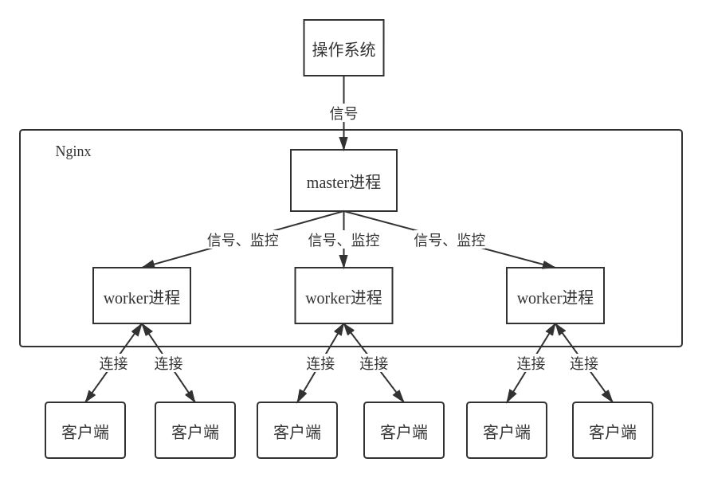
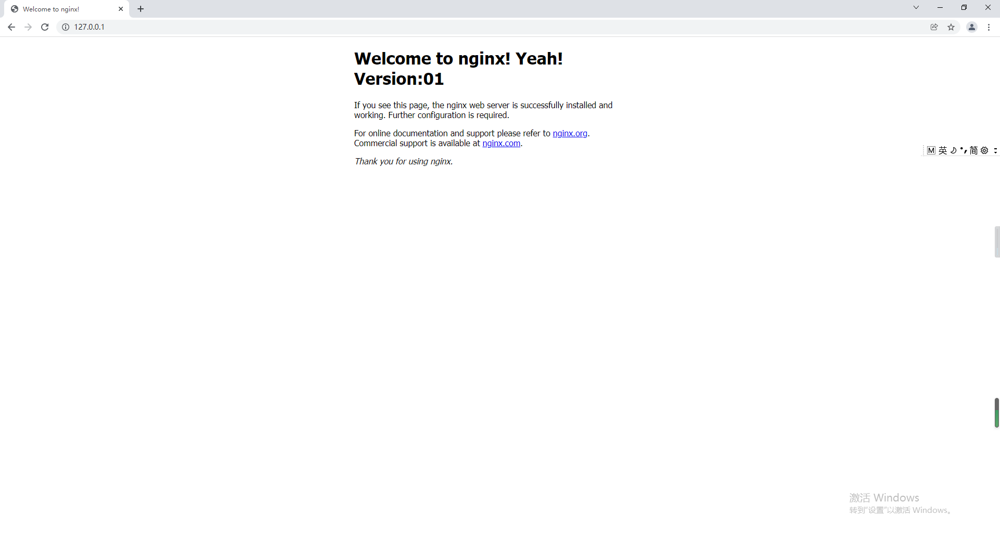
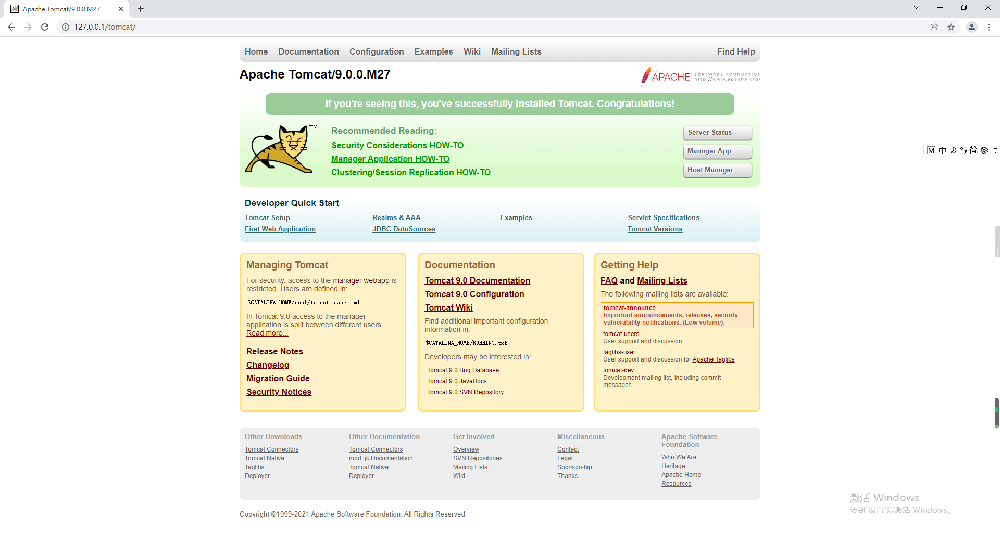
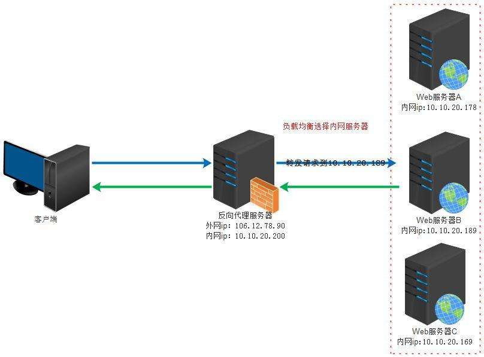
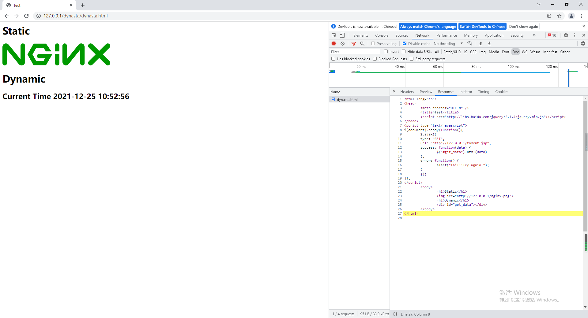
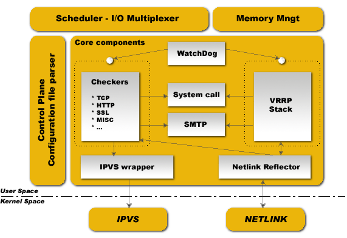

<h1 align = "center">Nginx学习笔记</h1>

​																																																														   ——by王浩

[TOC]

# 一、Nginx的概述

## 1、Nginx的简介

Nginx (engine x) 是一个高性能的HTTP和反向代理web服务器，同时也提供了IMAP/POP3/SMTP服务。Nginx是一款轻量级的Web服务器/反向代理服务器及电子邮件（IMAP/POP3）代理服务器，在BSD-like协议下发行。其特点是占有内存少，并发能力强，事实上nginx的并发能力在同类型的网页服务器中表现较好，中国大陆使用nginx网站用户有：百度、京东、新浪、网易、腾讯、淘宝等，可以支持高达50000个并发连接数。

## 2、Nginx的架构

nginx是以多进程的方式来工作的，当然nginx也是支持多线程的方式的，只是主流的方式还是多进程的方式，也是nginx的默认方式。nginx在启动后，会有一个master进程和多个worker进程。master进程主要用来管理worker进程，包含：接收来自外界的信号，向各worker进程发送信号，监控worker进程的运行状态，当worker进程退出后(异常情况下)，会自动重新启动新的worker进程。而基本的网络事件，则是放在worker进程中来处理了。多个worker进程之间是对等的，他们同等竞争来自客户端的请求，各进程互相之间是独立的。一个请求，只可能在一个worker进程中处理，一个worker进程，不可能处理其它进程的请求。worker进程的个数是可以设置的，一般会设置与机器cpu核数一致，这里面的原因与nginx的进程模型以及事件处理模型是分不开的。



## 3、Nginx的安装（基于docker）

### （1）运行容器

```shell
[root@localhost ~]# docker run -dit --name nginx2 -p 80:80 wanghao7/nginx:01
Unable to find image 'wanghao7/nginx:01' locally
Trying to pull repository docker.io/wanghao7/nginx ...
01: Pulling from docker.io/wanghao7/nginx
e1acddbe380c: Pull complete
e21006f71c6f: Pull complete
f3341cc17e58: Pull complete
2a53fa598ee2: Pull complete
12455f71a9b5: Pull complete
b86f2ba62d17: Pull complete
81bea8e6a2b1: Pull complete
Digest: sha256:3729280d59cbc95761311b6e5ab39147212337cbaab703bac32ffd00b66d696c
Status: Downloaded newer image for docker.io/wanghao7/nginx:01
c2f0eed95533c05719408c5b9adf6a0cf83e9842766f84153e15b462981bef42

[root@localhost ~]# docker ps
CONTAINER ID        IMAGE               COMMAND                  CREATED             STATUS              PORTS                NAMES
c2f0eed95533        wanghao7/nginx:01   "/docker-entrypoin..."   2 minutes ago       Up 2 minutes        0.0.0.0:80->80/tcp   nginx2
```

### （2）进入容器

进入容器，并查看nginx的进程信息

```shell
[root@localhost ~]# docker exec -it nginx2 bash
root@c2f0eed95533:/#

#一个master进程，一个worker进程
root@c2f0eed95533:/# ps aux|grep nginx
root         1  0.0  0.3  10772  3504 ?        Ss+  18:17   0:00 nginx: master process nginx -g daemon off;
nginx       32  0.0  0.1  11180  1796 ?        S+   18:22   0:00 nginx: worker process
root       361  0.0  0.0   3072   716 ?        S+   18:47   0:00 grep nginx
```

### （3）浏览器查看

* 查看端口

```shell
#查看default.conf文件，可以看到nginx设置的监听端口为80
root@c2f0eed95533:/# cat /etc/nginx/conf.d/default.conf
server {
    listen       80;
    ...
```

* 访问http://127.0.0.1/

可以看到nginx index页面说明nginx正常。




## 4、Nginx的常用命令

### （1）启动

```shell
root@c2f0eed95533:/# nginx
```

### （2）查看版本

```shell
root@c2f0eed95533:/# nginx -v
nginx version: nginx/1.21.1
```

### （3）停止

```shell
root@c2f0eed95533:/# nginx -s stop
```

### （4）重新加载

```shell
root@c2f0eed95533:/# nginx -s reload
2021/12/23 18:22:21 [notice] 31#31: signal process started
```

### （5）验证配置文件语法

```shell
root@c2f0eed95533:/# nginx -t
nginx: the configuration file /etc/nginx/nginx.conf syntax is ok
nginx: configuration file /etc/nginx/nginx.conf test is successful
```

### （6）查看Nginx安装时的配置参数

```shell
root@c2f0eed95533:/var/log/nginx# nginx -V
nginx version: nginx/1.21.1
built by gcc 8.3.0 (Debian 8.3.0-6)
built with OpenSSL 1.1.1d  10 Sep 2019
TLS SNI support enabled
configure arguments: --prefix=/etc/nginx --sbin-path=/usr/sbin/nginx --modules-path=/usr/lib/nginx/modules --conf-path=/etc/nginx/nginx.conf --error-log-path=/var/log/nginx/error.log --http-log-path=/var/log/nginx/access.log --pid-path=/var/run/nginx.pid --lock-path=/var/run/nginx.lock --http-client-body-temp-path=/var/cache/nginx/client_temp --http-proxy-temp-path=/var/cache/nginx/proxy_temp --http-fastcgi-temp-path=/var/cache/nginx/fastcgi_temp --http-uwsgi-temp-path=/var/cache/nginx/uwsgi_temp --http-scgi-temp-path=/var/cache/nginx/scgi_temp --user=nginx --group=nginx --with-compat --with-file-aio --with-threads --with-http_addition_module --with-http_auth_request_module --with-http_dav_module --with-http_flv_module --with-http_gunzip_module --with-http_gzip_static_module --with-http_mp4_module --with-http_random_index_module --with-http_realip_module --with-http_secure_link_module --with-http_slice_module --with-http_ssl_module --with-http_stub_status_module --with-http_sub_module --with-http_v2_module --with-mail --with-mail_ssl_module --with-stream --with-stream_realip_module --with-stream_ssl_module --with-stream_ssl_preread_module --with-cc-opt='-g -O2 -fdebug-prefix-map=/data/builder/debuild/nginx-1.21.1/debian/debuild-base/nginx-1.21.1=. -fstack-protector-strong -Wformat -Werror=format-security -Wp,-D_FORTIFY_SOURCE=2 -fPIC' --with-ld-opt='-Wl,-z,relro -Wl,-z,now -Wl,--as-needed -pie'
```

### （7）查看nginx进程

```shell
#一个master和一个worker进程
root@c2f0eed95533:/etc/nginx# ps aux |grep nginx
root         1  0.0  0.2  10852  2708 ?        Ss+  Dec23   0:00 nginx: master process nginx -g daemon off;
nginx      725  0.0  0.1  11100  1824 ?        S+   22:34   0:00 nginx: worker process
root       731  0.0  0.0   3072   716 ?        S+   22:46   0:00 grep nginx
```

## 5、Nginx的学习文档

Nginx官方文档：https://nginx.org/en/docs/


# 二、Nginx的配置文件

## 1、配置文件组成

Nginx的配置文件由俩部分组成，主配置文件nginx.conf和项目配置文件default.conf。

nginx.conf文件路径：/etc/nginx/nginx.conf

```shell
root@c2f0eed95533:/etc/nginx# ls
conf.d  fastcgi_params  mime.types  modules  nginx.conf  scgi_params  uwsgi_params
```

default.conf文件路径：/etc/nginx/conf.d/default.conf

```shell
root@c2f0eed95533:/etc/nginx# cd conf.d/
root@c2f0eed95533:/etc/nginx/conf.d# ls
default.conf
```

## 2、配置文件的模块

nginx配置文件主要分为六大模块：

```nginx
global           #作用域是全局
events           #nginx的工作模式
http             #http设置
  upstream       #负载均衡服务器设置
    server       #主机设置
      location   #URL配置
```

## 3、基础nginx.conf

```nginx
#定义Nginx运行的用户和用户组
user  nginx;

#nginx worker进程数，建议设置为等于CPU总核心数或者直接auto，默认为1
worker_processes  auto;

#全局错误日志定义类型，[ debug | info | notice | warn | error | crit ]，默认为error
error_log  /var/log/nginx/error.log notice;

#进程pid文件，存储nginx进程id
pid        /var/run/nginx.pid;

#指定进程可以打开的最大描述符：数目，工作模式与连接数上限
#这个指令是指当一个nginx进程打开的最多文件描述符数目，理论值应该是最多打开文件数（ulimit -n）与nginx进程数相除，但是nginx分配请求并不是那么均匀，所以最好与ulimit -n 的值保持一致。
#现在在linux 2.6内核下开启文件打开数为65535，worker_rlimit_nofile就相应应该填写65535。
#这是因为nginx调度时分配请求到进程并不是那么的均衡，所以假如填写10240，总并发量达到3-4万时就有进程可能超过10240了，这时会返回502错误。
#worker_rlimit_nofile 65535;


events {
    #参考事件模型，use [ kqueue | rtsig | epoll | /dev/poll | select | poll ]; epoll模型
    #是Linux 2.6以上版本内核中的高性能网络I/O模型，linux建议epoll，如果跑在FreeBSD上面，就用kqueue模型。
    #补充说明：
    #与apache相类，nginx针对不同的操作系统，有不同的事件模型
    #A）标准事件模型
    #select、poll属于标准事件模型，如果当前系统不存在更有效的方法，nginx会选择select或poll
    #B）高效事件模型
    #kqueue：使用于FreeBSD 4.1+, OpenBSD 2.9+, NetBSD 2.0 和 MacOS X.使用双处理器的MacOS X系统使用kqueue可能会造成内核崩溃。
    #spoll：使用于Linux内核2.6版本及以后的系统。
    #/dev/poll：使用于Solaris 7 11/99+，HP/UX 11.22+ (eventport)，IRIX 6.5.15+ 和 Tru64 UNIX 5.1A+。
    #eventport：使用于Solaris 10。 为了防止出现内核崩溃的问题， 有必要安装安全补丁。
    use epoll;
    
    #单个worker进程最大连接数（nginx最大连接数=worker_processes*workerworker_connections）
    #根据硬件调整，和前面工作进程配合起来用，尽量大，但是别把cpu跑到100%就行，取值最大65535。
    worker_connections  1024;
    
    #keepalive超时时间
    keepalive_timeout 60;  
}

#设定http服务器，利用它的反向代理功能提供负载均衡支持
http {
    error_log  /var/log/nginx/error2.log info;
    rewrite_log on;
    access_log /var/log/nginx/access2.log;
    
    #支持为多媒体类型，文件内容是列表
    include       /etc/nginx/mime.types;
    
    #默认文件类型 流类型，可以理解为是支持任意类型
    default_type  application/octet-stream;
    
    #默认编码utf-8
    charset utf-8;
    
    #日志格式设定
    #$remote_addr与$http_x_forwarded_for用以记录客户端的ip地址；
    #$remote_user：用来记录客户端用户名称；
    #$time_local： 用来记录访问时间与时区；
    #$request： 用来记录请求的url与http协议；
    #$status： 用来记录请求状态；成功是200，
    #$body_bytes_sent ：记录发送给客户端文件主体内容大小；
    #$http_referer：用来记录从那个页面链接访问过来的；
    #$http_user_agent：记录客户浏览器的相关信息；
    #通常web服务器放在反向代理的后面，这样就不能获取到客户的IP地址了，通过$remote_add拿到的IP地址是反向代理服务器的iP地址。反向代理服务器在转发请求的http头信息中，可以增加x_forwarded_for信息，用以记录原有客户端的IP地址和原来客户端的请求的服务器地址。
    log_format  main  '$remote_addr - $remote_user [$time_local] "$request" '
                      '$status $body_bytes_sent "$http_referer" '
                      '"$http_user_agent" "$http_x_forwarded_for"';
	#访问日志，每次访问http时，都会记录日志，main是日志格式
    access_log  /var/log/nginx/access.log  main;

    #开启高效文件传输模式，sendfile指令指定nginx是否调用sendfile函数来输出文件，对于普通应用设为 on，如果用来进行下载等应用磁盘IO重负载应用，可设置为off，以平衡磁盘与网络I/O处理速度，降低系统的负载。注意：如果图片显示不正常把这个改成off。
    #sendfile指令指定 nginx 是否调用sendfile 函数（zero copy 方式）来输出文件，对于普通应用，必须设为on。如果用来进行下载等应用磁盘IO重负载应用，可设置为off，以平衡磁盘与网络IO处理速度，降低系统uptime。
    sendfile        on;
    #tcp_nopush     on;

    #开启gzip压缩输出
    #gzip  on;

    #指定项目文件的位置
    include /etc/nginx/conf.d/*.conf;
}
```

## 4、基础default.conf

```nginx
#一个http可以有多个server，端口号和域名不能完全相同
server {
    #监听端口
    listen       80;
    listen  [::]:80;
    #域名可以有多个，用空格隔开，是要链接的服务器的域名或者ip
    server_name  localhost;
	#访问server时，http开启日志则会被http日志记录，http未开启时，开启server日志，则只有fangwenserver，才会记录日志
    #access_log  /var/log/nginx/serveraccess.log  main;
    
    #访问根路径（http://127.00.0.1/）时，会被location /处理，访问/usr/share/nginx/html/index.html或者/usr/share/nginx/html/index.htm
    location / {
        #root表示本地磁盘根路径
        root   /usr/share/nginx/html;
        #目录/usr/share/nginx/html下的文件
        index  index.html index.htm;
    }
    #服务器错误时的显示页面
    error_page   500 502 503 504  /50x.html;
    location = /50x.html {
        root   /usr/share/nginx/html;
    }

}
```


# 三、Nginx的日志

## 1、日志类型

Nginx日志主要分为两种：访问日志和错误日志。日志开关在Nginx配置文件（/etc/nginx/nginx.conf）中设置，两种日志都可以选择性关闭，默认都是打开的。

### （1）访问日志

访问日志主要记录客户端访问Nginx的每一个请求，格式可以自定义。通过访问日志，可以得到用户地域来源、跳转来源、使用终端、某个URL访问量等相关信息。

### （2）错误日志

错误日志主要记录客户端访问Nginx出错时的日志，格式不支持自定义。通过错误日志，可以得到系统某个服务或server的性能瓶颈等。

## 2、访问日志设置

Nginx中访问日志相关指令主要有两条：log_format和access_log。

### （1）log_format

log_format用来设置日志格式，也就是日志文件中每条日志的格式，log_format配置必须放在http内。

```nginx
log_format name(格式名称) type(格式样式)
```

如默认的格式所示

```
    log_format  main  '$remote_addr - $remote_user [$time_local] "$request" '
                      '$status $body_bytes_sent "$http_referer" '
                      '"$http_user_agent" "$http_x_forwarded_for"';
```

main为日志格式名字，方便后面引用。main后的是格式参数，显示日志显示的内容和格式。

日志的格式变量参数如下：

```nginx
$args                    #请求中的参数值
$query_string            #同 $args
$arg_NAME                #GET请求中NAME的值
$is_args                 #如果请求中有参数，值为"?"，否则为空字符串
$uri                     #请求中的当前URI(不带请求参数，参数位于$args)，可以不同于浏览器传递的$request_uri的值，它可以通过内部重定向，或者使用index指令进行修改，$uri不包含主机名，如"/foo/bar.html"。
$document_uri            #同 $uri
$document_root           #当前请求的文档根目录或别名
$host                    #优先级：HTTP请求行的主机名>"HOST"请求头字段>符合请求的服务器名.请求中的主机头字段，如果请求中的主机头不可用，则为服务器处理请求的服务器名称
$hostname                #主机名
$https                   #如果开启了SSL安全模式，值为"on"，否则为空字符串。
$binary_remote_addr      #客户端地址的二进制形式，固定长度为4个字节
$body_bytes_sent         #传输给客户端的字节数，响应头不计算在内；这个变量和Apache的mod_log_config模块中的"%B"参数保持兼容
$bytes_sent              #传输给客户端的字节数
$connection              #TCP连接的序列号
$connection_requests     #TCP连接当前的请求数量
$content_length          #"Content-Length" 请求头字段
$content_type            #"Content-Type" 请求头字段
$cookie_name             #cookie名称
$limit_rate              #用于设置响应的速度限制
$msec                    #当前的Unix时间戳
$nginx_version           #nginx版本
$pid                     #工作进程的PID
$pipe                    #如果请求来自管道通信，值为"p"，否则为"."
$proxy_protocol_addr     #获取代理访问服务器的客户端地址，如果是直接访问，该值为空字符串
$realpath_root           #当前请求的文档根目录或别名的真实路径，会将所有符号连接转换为真实路径
$remote_addr             #客户端地址
$remote_port             #客户端端口
$remote_user             #用于HTTP基础认证服务的用户名
$request                 #代表客户端的请求地址
$request_body            #客户端的请求主体：此变量可在location中使用，将请求主体通过proxy_pass，fastcgi_pass，uwsgi_pass和scgi_pass传递给下一级的代理服务器
$request_body_file       #将客户端请求主体保存在临时文件中。文件处理结束后，此文件需删除。如果需要之一开启此功能，需要设置client_body_in_file_only。如果将次文件传 递给后端的代理服务器，需要禁用request body，即设置proxy_pass_request_body off，fastcgi_pass_request_body off，uwsgi_pass_request_body off，or scgi_pass_request_body off
$request_completion      #如果请求成功，值为"OK"，如果请求未完成或者请求不是一个范围请求的最后一部分，则为空
$request_filename        #当前连接请求的文件路径，由root或alias指令与URI请求生成
$request_length          #请求的长度 (包括请求的地址，http请求头和请求主体)
$request_method          #HTTP请求方法，通常为"GET"或"POST"
$request_time            #处理客户端请求使用的时间,单位为秒，精度毫秒； 从读入客户端的第一个字节开始，直到把最后一个字符发送给客户端后进行日志写入为止。
$request_uri             #这个变量等于包含一些客户端请求参数的原始URI，它无法修改，请查看$uri更改或重写URI，不包含主机名，例如："/cnphp/test.php?arg=freemouse"
$scheme                  #请求使用的Web协议，"http" 或 "https"
$server_addr             #服务器端地址，需要注意的是：为了避免访问linux系统内核，应将ip地址提前设置在配置文件中
$server_name             #服务器名
$server_port             #服务器端口
$server_protocol         #服务器的HTTP版本，通常为 "HTTP/1.0" 或 "HTTP/1.1"
$status                  #HTTP响应代码
$time_iso8601            #服务器时间的ISO 8610格式
$time_local              #服务器时间（LOG Format 格式）
$cookie_NAME             #客户端请求Header头中的cookie变量，前缀"$cookie_"加上cookie名称的变量，该变量的值即为cookie名称的值
$http_NAME               #匹配任意请求头字段；变量名中的后半部分NAME可以替换成任意请求头字段，如在配置文件中需要获取http请求头："Accept-Language"，$http_accept_language即可
$http_cookie
$http_host               #请求地址，即浏览器中你输入的地址（IP或域名）
$http_referer            #url跳转来源,用来记录从那个页面链接访问过来的
$http_user_agent         #用户终端浏览器等信息
$http_x_forwarded_for
$sent_http_NAME          #可以设置任意http响应头字段；变量名中的后半部分NAME可以替换成任意响应头字段，如需要设置响应头Content-length，$sent_http_content_length即可
$sent_http_cache_control
$sent_http_connection
$sent_http_content_type
$sent_http_keep_alive
$sent_http_last_modified
$sent_http_location
$sent_http_transfer_encoding
```

### （2）access_log

access_log指令用来指定日志文件的存放路径（包含日志文件名）、格式和缓存大小。

```nginx
access_log path(存放路径) [format(自定义日志格式名称) [buffer=size | off]]
```

如默认的access_log设置所示，存储日志路径为/var/log/nginx/access.log，使用的格式为main

```nginx
access_log  /var/log/nginx/access.log  main;
```

### （3）关闭访问日志

如果想关闭日志，可以直接设置off：

```nginx
access_log off;
```

### （4）注意事项

* 能够使用access_log指令的字段包括：http、server、location，log_format只能在http模块中。
* Nginx进程设置的用户和组必须对日志路径有创建文件的权限，否则，会报错。
* Nginx支持为每个location指定强大的日志记录。同样的连接可以在同一时间输出到不止一个的日志中。

## 3、错误日志设置

### （1）设置指令

错误日志由指令error_log来指定

```nginx
error_log path(存放路径) level(日志等级)
```

如默认的access_log设置所示，存储日志路径为/var/log/nginx/error.log，记录notice以上级别的error log。

```nginx
error_log  /var/log/nginx/error.log notice;
```

### （2）错误日志级别

默认为error，从左到右，级别越来越高，内容越来越简单。

```nginx
[ debug | info | notice | warn | error | crit ]
```

### （3）关闭错误日志

error_log off并不能关闭错误日志，而是会将错误日志记录到一个文件名为off的文件中，

正确的关闭错误日志记录功能的方法如下：

```nginx
#将存储日志的路径设置为“垃圾桶”
error_log /dev/null;
```

## 4、其他设置日志的指令

### （1）open_log_file_cache

对于每一条日志记录，都将是先打开文件，再写入日志，然后关闭。可以使用open_log_file_cache来设置日志文件缓存（默认是off）。配置段: http, server, location。

```nginx
open_log_file_cache max=N [inactive=time] [min_uses=N] [valid=time];
open_log_file_cache max=1000 inactive=20s valid=1m min_uses=2;
```

max：设置缓存中的最大文件描述符数量，如果缓存被占满，采用LRU算法将描述符关闭。
inactive：设置存活时间，默认是10s。
min_uses：设置在inactive时间段内，日志文件最少使用多少次后，该日志文件描述符记入缓存中，默认是1次。
valid：设置检查频率，默认60s。
off：禁用缓存。

### （2）log_not_found

是否在error_log中记录不存在的错误，默认是。配置段: http, server, location。

```nginx
log_not_found on | off;
```

### （3）log_subrequest

是否在access_log中记录子请求的访问日志，默认不记录。配置段: http, server, location。

```nginx
log_subrequest on | off;
```

### （4）rewrite_log

由ngx_http_rewrite_module模块提供的。用来记录重写日志的。对于调试重写规则建议开启。

```nginx
rewrite_log on | off;
```

配置段: http, server, location。

## 5、重设默认日志

由于使用的是容器，在/var/log/nginx中查看日志是没有东西的，因为两个软连接，分别输出到/dev/stdout和/dev/stderr两个位置，这实际是输出到了容器的前台日志。

```shell
root@c2f0eed95533:/var/log/nginx# ls -l
total 0
lrwxrwxrwx. 1 root root 11 Aug 17 11:46 access.log -> /dev/stdout
lrwxrwxrwx. 1 root root 11 Aug 17 11:46 error.log -> /dev/stderr
```

持久化存储只需要将/var/log/nginx 目录挂载出来，两个软连接自然就没有了，日志被保存在文件中。但此时，容器前台日志也不会输出这些信息了。也可以开启重写设置。

### （1）配置新的日志文件

在配置文件中配置下log文件，保留两个软连接，重新创建两个日志文件：

```nginx
#/etc/nginx/nginx.conf

user  nginx;
worker_processes  auto;

error_log  /var/log/nginx/error.log notice;
pid        /var/run/nginx.pid;


events {
    worker_connections  1024;
}


http {
    #添加新的error2.log文件和access2.log
    error_log  /var/log/nginx/error2.log info;
    rewrite_log on;
    access_log /var/log/nginx/access2.log;
    include       /etc/nginx/mime.types;
    default_type  application/octet-stream;

    log_format  main  '$remote_addr - $remote_user [$time_local] "$request" '
                      '$status $body_bytes_sent "$http_referer" '
                      '"$http_user_agent" "$http_x_forwarded_for"';

    access_log  /var/log/nginx/access.log  main;
    sendfile        on;
    #tcp_nopush     on;

    keepalive_timeout  65;

    #gzip  on;

    include /etc/nginx/conf.d/*.conf;
}
```

### （2）重新加载配置文件

```shell
root@c2f0eed95533:/etc/nginx# nginx -s reload
2021/12/23 20:11:24 [notice] 510#510: signal process started
```

### （3）查看日志

* 查看文件

```shell
#已经创建新的文件了
root@c2f0eed95533:/var/log/nginx# ls
access.log  access2.log  error.log  error2.log
```

* 再次访问http://127.0.0.1/，查看日志

```shell
root@c2f0eed95533:/var/log/nginx# cat access2.log
10.0.2.2 - - [23/Dec/2021:20:13:08 +0000] "GET / HTTP/1.1" 304 0 "-" "Mozilla/5.0 (Windows NT 10.0; Win64; x64) AppleWebKit/537.36 (KHTML, like Gecko) Chrome/96.0.4664.110 Safari/537.36"
10.0.2.2 - - [23/Dec/2021:20:13:08 +0000] "GET / HTTP/1.1" 304 0 "-" "Mozilla/5.0 (Windows NT 10.0; Win64; x64) AppleWebKit/537.36 (KHTML, like Gecko) Chrome/96.0.4664.110 Safari/537.36"
10.0.2.2 - - [23/Dec/2021:20:13:08 +0000] "GET / HTTP/1.1" 304 0 "-" "Mozilla/5.0 (Windows NT 10.0; Win64; x64) AppleWebKit/537.36 (KHTML, like Gecko) Chrome/96.0.4664.110 Safari/537.36"
10.0.2.2 - - [23/Dec/2021:20:13:08 +0000] "GET / HTTP/1.1" 304 0 "-" "Mozilla/5.0 (Windows NT 10.0; Win64; x64) AppleWebKit/537.36 (KHTML, like Gecko) Chrome/96.0.4664.110 Safari/537.36"
10.0.2.2 - - [23/Dec/2021:20:13:10 +0000] "GET / HTTP/1.1" 304 0 "-" "Mozilla/5.0 (Windows NT 10.0; Win64; x64) AppleWebKit/537.36 (KHTML, like Gecko) Chrome/96.0.4664.110 Safari/537.36"
```

## 6、自定义日志

由于实验的需要，需要设置日志的格式来观察结果，需要显示服务器的ip和地址等信息。

### （1）声明一个新的log_format

在http模块，声明一个新的log_format并命名tomcat，输出upstream_addr。

```nginx
log_format tomcat '$upstream_addr';
```

### （2）设置access_log

在http、server、location其中一个地方设置access_log，为了看起来方便清楚，可以和log_format放在一起。

```nginx
access_log  /var/log/nginx/tomcat.log  tomcat;
```

### （3）设置upstream模块

```nginx
#default.conf
#增加upstream模块
upstream tomcat {
    #添加tomcat2服务器,172.17.0.3:8080为tomcat2容器的ip地址和端口
    server 172.17.0.3:8080;
}
server {
    listen       80;
    listen  [::]:80;
    server_name localhost;

    location / {
        proxy_pass http://tomcat/
        root   /usr/share/nginx/html;
        index  index.html index.htm;
    }  
    error_page   500 502 503 504  /50x.html;
    location = /50x.html {
        root   /usr/share/nginx/html;
    }
}
```

### （4）重新加载nginx配置文件

```shell
root@c2f0eed95533:/etc/nginx# cat nginx.conf
user  nginx;
worker_processes  auto;

error_log  /var/log/nginx/error.log notice;
pid        /var/run/nginx.pid;


events {
    worker_connections  1024;
}


http {
    error_log  /var/log/nginx/error2.log info;
    rewrite_log on;
    access_log /var/log/nginx/access2.log;
    include       /etc/nginx/mime.types;
    default_type  application/octet-stream;

    log_format  main  '$remote_addr - $remote_user [$time_local] "$request" '
                      '$status $body_bytes_sent "$http_referer" '
                      '"$http_user_agent" "$http_x_forwarded_for"';

    access_log  /var/log/nginx/access.log  main;
    log_format tomcat '$upstream_addr';
    access_log  /var/log/nginx/tomcat.log  tomcat;
    sendfile        on;
    #tcp_nopush     on;

    keepalive_timeout  65;

    #gzip  on;

    include /etc/nginx/conf.d/*.conf;
}

root@c2f0eed95533:/etc/nginx# nginx -s reload
2021/12/24 22:34:51 [notice] 724#724: signal process started
```

### （5）查看新的日志文件

```shell
#新的log文件已经生成
root@c2f0eed95533:/var/log/nginx# ls
access.log  access2.log  error.log  error2.log  tomcat.log

#访问多次http://127.0.0.1/页面后
root@c2f0eed95533:/var/log/nginx# cat tomcat.log
172.17.0.3:8080
172.17.0.3:8080
172.17.0.3:8080
172.17.0.3:8080
172.17.0.3:8080
172.17.0.3:8080
```


# 四、Nginx Status页面

## 1、Nginx status页面的简介

Nginx内建了一个状态页，只需修改Nginx配置启用Status即可，对于想了解nginx的状态以及监控nginx非常有帮助。

## 2、启用Nginx status页面

修改nginx配置文件default.conf

```nginx
#default.conf
server {
    listen       80;
    listen  [::]:80;
    server_name localhost;

    location / {
        root   /usr/share/nginx/html;
        index  index.html index.htm;
    }
    #添加status页面，stub_status on;
    location /status/ {
        stub_status on;
        access_log off;
    }
    location /tomcat/ {
        proxy_pass http://172.17.0.3:8080/;
    }
    error_page   500 502 503 504  /50x.html;
    location = /50x.html {
        root   /usr/share/nginx/html;
    }

}
```

## 3、重新加载Nginx配置文件

```shell
root@c2f0eed95533:/etc/nginx/conf.d# nginx -s reload
2021/12/25 00:22:47 [notice] 748#748: signal process started
```

## 4、查看Nginx status页面

访问http://127.0.0.1/status/


## 5、Nginx Status页面说明

| 参数                            | 说明                                                         |
| ------------------------------- | ------------------------------------------------------------ |
| Active connections              | 活跃的连接数量                                               |
| server accepts handled requests | 总共处理了117个连接 , 成功创建117次握手, 总共处理了326个请求 |
| reading                         | 读取客户端的连接数                                           |
| writing                         | 响应数据到客户端的数量                                       |
| waiting                         | 开启 keep-alive 的情况下，这个值等于 active (reading+writing)，意思就是Nginx已经处理完正在等候下一次请求指令的驻留连接 |

 

# 五、Nginx的反向代理

## 1、正向代理简介

正向代理，意思是一个位于客户端和原始服务器(origin server)之间的服务器，为了从原始服务器取得内容，客户端向代理发送一个请求并指定目标(原始服务器)，然后代理向原始服务器转交请求并将获得的内容返回给客户端。客户端才能使用正向代理。


## 2、反向代理简介

反向代理服务器位于用户与目标服务器之间，但是对于用户而言，反向代理服务器就相当于目标服务器，即用户直接访问反向代理服务器就可以获得目标服务器的资源。同时，用户不需要知道目标服务器的地址，也无须在用户端作任何设定。反向代理服务器通常可用来作为Web加速，即使用反向代理作为Web服务器的前置机来降低网络和服务器的负载，提高访问效率。

nginx实现反向代理是靠proxy_pass模块实现的。


## 3、location配置匹配规则

### （1）语法规则

```nginx
location [=|~|~*|^~] /url/ { … } 
```

| 运算符 | 说明                                                    |
| ------ | ------------------------------------------------------- |
| =      | 用于不含正则表达式的url前，要求请求字符与url严格匹配    |
| ~      | 用于表示url包含正则表达式，并且区分大小写，以什么结尾   |
| ~*     | 用于表示url包含正则表达式，并且不区分大小写，以什么结尾 |
| ^~     | ^~ 表示以什么开头                                       |
| !~     | 用于表示url包含正则表达式，并且区分大小写，不匹配       |
| !~*    | 用于表示url包含正则表达式，并且不区分大小写，不匹配     |

### （2）proxy_pass路径匹配规则

| location         | proxy_pass          | 代理路径                             |
| ---------------- | ------------------- | ------------------------------------ |
| /proxy_location/ | http://server       | http://server/proxy_location/my_path |
| /proxy_location/ | http://server/      | http://server/my_path                |
| /proxy_location  | http://server       | http://server/proxy_location/my_path |
| /proxy_location  | http://server/      | http://server//my_path               |
| /proxy_location/ | http://server/path  | http://server/pathmy_path            |
| /proxy_location/ | http://server/path/ | http://server/path/my_path           |
| /proxy_location  | http://server/path  | http://server/path/my_path           |
| /proxy_location  | http://server/path/ | http://server//my_path               |

### （3）root和alias路径匹配规则

root与alias主要区别在于nginx如何解释location后面的uri，这会使两者分别以不同的方式将请求映射到服务器文件上。

* root实例

```nginx
#如果一个请求的URI是/t/a.html时，web服务器将会返回服务器上的/www/root/html/t/a.html的文件。
location ^~ /t/ {
     root /www/root/html/;
}
```

* alias实例

```nginx
#如果一个请求的URI是/t/a.html时，web服务器将会返回服务器上的/www/root/html/new_t/a.html的文件。注意这里是new_t，因为alias会把location后面配置的路径丢弃掉，把当前匹配到的目录指向到指定的目录。
location ^~ /t/ {
 alias /www/root/html/new_t/;
}
```

* 注意事项

使用alias时，目录名后面一定要加"/"。
alias在使用正则匹配时，必须捕捉要匹配的内容并在指定的内容处使用。
alias只能位于location块中。（root可以不放在location中）

## 4、实现反向代理的示例

### （1）运行tomcat服务器

* 运行tomcat容器

```shell
[root@localhost ~]# docker run -dit --name tomcat2 -p 8080:8080 tomcat:9.0.0
Unable to find image 'tomcat:9.0.0' locally
Trying to pull repository docker.io/library/tomcat ...
9.0.0: Pulling from docker.io/library/tomcat
219d2e45b4af: Pull complete
ef9ce992ffe4: Pull complete
d0df8518230c: Pull complete
63678957352b: Pull complete
929e9da71fa4: Pull complete
96ef2abace74: Pull complete
ee465bb23abd: Pull complete
7389ed23519a: Pull complete
01dc7810fc78: Pull complete
4afd531fccde: Pull complete
30db10edc30a: Pull complete
e639e049f24b: Pull complete
715be7738f43: Pull complete
Digest: sha256:2714c87352a459742d411f40ce928495f15d61639f35613d74b40388112fac3f
Status: Downloaded newer image for docker.io/tomcat:9.0.0
```

* 查看容器

```shell
[root@localhost ~]# docker ps
CONTAINER ID        IMAGE               COMMAND                  CREATED             STATUS              PORTS                    NAMES
3a9963787d06        tomcat:9.0.0        "catalina.sh run"        35 seconds ago      Up 34 seconds       0.0.0.0:8080->8080/tcp   tomcat2
c2f0eed95533        wanghao7/nginx:01   "/docker-entrypoin..."   11 hours ago        Up 11 hours         0.0.0.0:80->80/tcp       nginx2
```

* 浏览器查看

访问http://127.0.0.1:8080/


### （2）反向代理端口设置

windows访问http://127.0.0.1/，看到的是nginx的首页，访问http://127.0.0.1/tomcat/，看到的是tomcat的首页，nginx反向代理tomcat2服务器。

| server            | ip         | port |
| ----------------- | ---------- | ---- |
| Windows           | 127.0.0.1  | 80   |
| Linux             | 10.0.2.15  | 80   |
| nginx2 container  | 172.17.0.2 | 80   |
| tomcat2 container | 172.17.0.3 | 8080 |

### （3）配置nginx配置文件

* 配置/etc/nginx/conf.d/default.conf

```nginx
#default.conf
server {
    listen       80;
    listen  [::]:80;
    server_name localhost;

    location / {
        root   /usr/share/nginx/html;
        index  index.html index.htm;
    }
	#172.17.0.3:8080tomcat的服务器地址和端口
    location /tomcat/ {
        proxy_pass http://172.17.0.3:8080/;
    }

    error_page   500 502 503 504  /50x.html;
    location = /50x.html {
        root   /usr/share/nginx/html;
    }

}
```

* 重新加载nginx配置

```shell
root@c2f0eed95533:/etc/nginx/conf.d# nginx -s reload
2021/12/24 08:12:43 [notice] 579#579: signal process started
```

### （4）验证反向代理

* 访问http://127.0.0.1/，响应的是nginx的首页内容，未反向代理


* 访问http://127.0.0.1/tomcat/，响应的是tomcat的首页，nginx反向代理tomcat




# 六、Nginx的负载均衡

## 1、负载均衡简介

当一台服务器的单位时间内的访问量越大时，服务器压力就越大，大到超过自身承受能力时，服务器就会崩溃。为了避免服务器崩溃，让用户有更好的体验，我们通过负载均衡的方式来分担服务器压力。

我们可以建立很多很多服务器，组成一个服务器集群，当用户访问网站时，先访问一个中间服务器，在让这个中间服务器在服务器集群中选择一个压力较小的服务器，然后将该访问请求引入该服务器。如此以来，用户的每次访问，都会保证服务器集群中的每个服务器压力趋于平衡，分担了服务器压力，避免了服务器崩溃的情况。

负载均衡实现原理是通过nginx proxy_pass模块和upstream模块实现的。客户端发送请求，由nginx代理转发upstream服务池。



## 2、Nginx负载均衡的环境准备

当请求到nginx2时，nginx2根据设置负载均衡的规则，分别将请求分发到tomcat2和tomcat3上。

### （1）新建tomcat容器

* 查看当前的容器

```shell
[root@localhost ~]# docker ps
CONTAINER ID        IMAGE               COMMAND                  CREATED             STATUS              PORTS                    NAMES
3a9963787d06        tomcat:9.0.0        "catalina.sh run"        4 hours ago         Up 4 hours          0.0.0.0:8080->8080/tcp   tomcat2
c2f0eed95533        wanghao7/nginx:01   "/docker-entrypoin..."   16 hours ago        Up 16 hours         0.0.0.0:80->80/tcp       nginx2
```

* 运行tomcat3

```shell
[root@localhost ~]# docker run -dit --name tomcat3 -p 8081:8080 tomcat:9.0.0
c6b7f5d9783dce7ee3fbf71e12dcf93d1741f48565e5091397c47de5ac2eed09
```

* 再次查看运行的容器

```shell
[root@localhost ~]# docker ps
CONTAINER ID        IMAGE               COMMAND                  CREATED             STATUS              PORTS                    NAMES
c6b7f5d9783d        tomcat:9.0.0        "catalina.sh run"        4 seconds ago       Up 3 seconds        0.0.0.0:8081->8080/tcp   tomcat3
3a9963787d06        tomcat:9.0.0        "catalina.sh run"        5 hours ago         Up 5 hours          0.0.0.0:8080->8080/tcp   tomcat2
c2f0eed95533        wanghao7/nginx:01   "/docker-entrypoin..."   16 hours ago        Up 16 hours         0.0.0.0:80->80/tcp       nginx2
```

### （2）负载均衡的端口设置

windows访问http://127.0.0.1/，看到的是nginx的首页，访问http://127.0.0.1/tomcat/，看到的是tomcat的首页，nginx负载均衡分发到tomcat2和tomcat3服务器。

| server            | ip         | port |
| ----------------- | ---------- | ---- |
| Windows           | 127.0.0.1  | 80   |
| Linux             | 10.0.2.15  | 80   |
| nginx2 container  | 172.17.0.2 | 80   |
| tomcat2 container | 172.17.0.3 | 8080 |
| tomcat3 container | 172.17.0.4 | 8080 |

### （3）添加日志格式

* 修改nginx.conf

现在的版本，不允许在server模块中添加日志，需要在http模块中添加。

```nginx
user  nginx;
worker_processes  auto;

error_log  /var/log/nginx/error.log notice;
pid        /var/run/nginx.pid;


events {
    worker_connections  1024;
}


http {
    error_log  /var/log/nginx/error2.log info;
    rewrite_log on;
    access_log /var/log/nginx/access2.log;
    include       /etc/nginx/mime.types;
    default_type  application/octet-stream;

    log_format  main  '$remote_addr - $remote_user [$time_local] "$request" '
                      '$status $body_bytes_sent "$http_referer" '
                      '"$http_user_agent" "$http_x_forwarded_for"';

    access_log  /var/log/nginx/access.log  main;
    #设置访问server的日志格式
    log_format tomcat '$upstream_addr';
    #设置访问server的日志文件位置
    access_log  /var/log/nginx/tomcat.log  tomcat;
    sendfile        on;
    #tcp_nopush     on;

    keepalive_timeout  65;

    #gzip  on;

    include /etc/nginx/conf.d/*.conf;
}
```

* 重新加载配置文件

```shell
root@c2f0eed95533:/etc/nginx# nginx -s reload
2021/12/24 12:42:23 [notice] 632#632: signal process started
```

* 查看文件

```shell
root@c2f0eed95533:/var/log/nginx# ls
access.log  access2.log  error.log  error2.log  tomcat.log
```

## 3、Nginx负载均衡的方式

### （1）轮询（默认）

* 定义：将用户的请求按顺序依次转发到不同的服务器上，每个请求按时间顺序逐一分配到不同的后端服务器，如果后端服务器down掉，能自动剔除。
* 修改nginx配置文件

```nginx
#default.conf
#增加upstream模块
upstream tomcat {
    #添加tomcat2服务器
    server 172.17.0.3:8080;
    #添加tomcat3服务器
    server 172.17.0.4:8080;
}
server {
    listen       80;
    listen  [::]:80;
    server_name localhost;

    location / {
        root   /usr/share/nginx/html;
        index  index.html index.htm;
    }
	#反向代理配置http://tomcat/中tomcat是upstream模块
    location /tomcat/ {
        proxy_pass http://tomcat/;
    }    
    error_page   500 502 503 504  /50x.html;
    location = /50x.html {
        root   /usr/share/nginx/html;
    }
}
```

* 重新加载配置文件

```shell
root@c2f0eed95533:/etc/nginx# nginx -s reload
2021/12/24 12:49:18 [notice] 637#637: signal process started
```

* 新建session查看tomcat.log文件

```
root@c2f0eed95533:/var/log/nginx# tail -f tomcat.log

```

* 访问http://127.0.0.1/tomcat/十次

十次的页面都是一样的，都是tomcat的首页


* 查看log文件显示

按照server列表轮流访问，即轮询。

```shell
root@c2f0eed95533:/var/log/nginx# tail -f tomcat.log
172.17.0.3:8080
172.17.0.4:8080
172.17.0.3:8080
172.17.0.4:8080
172.17.0.3:8080
172.17.0.4:8080
172.17.0.3:8080
172.17.0.4:8080
172.17.0.3:8080
172.17.0.4:8080
```

### （2）权重weight

* 定义：指定轮询几率，weight和访问比率成正比，用于后端服务器性能不均的情况。
* 修改nginx配置文件

```nginx
#default.conf
#增加upstream模块
upstream tomcat {
    #添加tomcat2服务器，权重为3
    server 172.17.0.3:8080 weight=3;
    #添加tomcat3服务器，权重为7
    server 172.17.0.4:8080 weight=7;
}
server {
    listen       80;
    listen  [::]:80;
    server_name localhost;

    location / {
        root   /usr/share/nginx/html;
        index  index.html index.htm;
    }
	#反向代理配置http://tomcat/中tomcat是upstream模块
    location /tomcat/ {
        proxy_pass http://tomcat/;
    }    
    error_page   500 502 503 504  /50x.html;
    location = /50x.html {
        root   /usr/share/nginx/html;
    }
}
```

* 删除之前的日志文件

为观察方便，删除之前的upstream日志

```shell
root@c2f0eed95533:/var/log/nginx# rm tomcat.log
root@c2f0eed95533:/var/log/nginx# ls
access.log  access2.log  error.log  error2.log
```

* 重新加载配置文件

```shell
root@c2f0eed95533:/var/log/nginx# nginx -s reload
2021/12/24 13:49:42 [notice] 671#671: signal process started

root@c2f0eed95533:/var/log/nginx# ls
access.log  access2.log  error.log  error2.log  tomcat.log
```

* 新建session查看tomcat.log文件

```shell
root@c2f0eed95533:/var/log/nginx# tail -f tomcat.log

```

* 访问http://127.0.0.1/tomcat/十次

十次的页面都是一样的，都是tomcat的首页


* 查看log文件显示

按照设置的权重比例访问，访问172.17.0.3次数为3，访问172.17.0.4次数为7。

```shell
root@c2f0eed95533:/var/log/nginx# tail -f tomcat.log
172.17.0.4:8080
172.17.0.3:8080
172.17.0.4:8080
172.17.0.4:8080
172.17.0.3:8080
172.17.0.4:8080
172.17.0.4:8080
172.17.0.4:8080
172.17.0.3:8080
172.17.0.4:8080
```

### （3）ip地址哈希iphash

* 定义：轮询和群众存在一个问题，在负载均衡系统中，假如用户在某台服务器上登录了，那么该用户第二次请求的时候，因为我们是负载均衡系统，每次请求都会重新定位到服务器集群中的某一个，那么已经登录某一个服务器的用户再重新定位到另一个服务器，其登录信息将会丢失，这样显然是不妥的。可以采用ip_hash指令解决这个问题，如果客户已经访问了某个服务器，当用户再次访问时，会将该请求通过哈希算法，自动定位到该服务器。
* 修改nginx配置文件

```nginx
#default.conf
#增加upstream模块
upstream tomcat {
    #每个请求按访问ip的hash结果分配，这样每个访客固定访问一个后端服务器，可以解决session的问题。
    ip_hash;
    #添加tomcat2服务器
    server 172.17.0.3:8080;
    #添加tomcat3服务器
    server 172.17.0.4:8080;
}
server {
    listen       80;
    listen  [::]:80;
    server_name localhost;

    location / {
        root   /usr/share/nginx/html;
        index  index.html index.htm;
    }
	#反向代理配置http://tomcat/中tomcat是upstream模块
    location /tomcat/ {
        proxy_pass http://tomcat/;
    }    
    error_page   500 502 503 504  /50x.html;
    location = /50x.html {
        root   /usr/share/nginx/html;
    }
}
```

* 删除之前的日志文件

```shell
root@c2f0eed95533:/var/log/nginx# rm tomcat.log
root@c2f0eed95533:/var/log/nginx# ls
access.log  access2.log  error.log  error2.log
```

* 重新加载配置文件

```shell
root@c2f0eed95533:/var/log/nginx# nginx -s reload
2021/12/24 13:51:02 [notice] 675#675: signal process started

root@c2f0eed95533:/var/log/nginx# ls
access.log  access2.log  error.log  error2.log  tomcat.log
```

* 新建session查看tomcat.log文件

```shell
root@c2f0eed95533:/var/log/nginx# tail -f tomcat.log

```

* 访问http://127.0.0.1/tomcat/十次

十次的页面都是一样的，都是tomcat的首页


* 查看log文件显示

因为是同一个用户访问，第一次访问的是172.17.0.4:8080，所以根据ip_hash算法，全部分发负载到当前用户登陆服务器上。

```shell
root@c2f0eed95533:/var/log/nginx#  tail -f tomcat.log
172.17.0.4:8080
172.17.0.4:8080
172.17.0.4:8080
172.17.0.4:8080
172.17.0.4:8080
172.17.0.4:8080
172.17.0.4:8080
172.17.0.4:8080
172.17.0.4:8080
172.17.0.4:8080
```

### （4）最少连接least_conn

* 定义：请求会被转发到连接数最少的服务器上。
* 修改nginx配置文件

```nginx
#default.conf
#增加upstream模块
upstream tomcat {
    #分发请求到连接数较小的一个服务器上。
    least_conn;
    #添加tomcat2服务器
    server 172.17.0.3:8080;
    #添加tomcat3服务器
    server 172.17.0.4:8080;
}
server {
    listen       80;
    listen  [::]:80;
    server_name localhost;

    location / {
        root   /usr/share/nginx/html;
        index  index.html index.htm;
    }
	#反向代理配置http://tomcat/中tomcat是upstream模块
    location /tomcat/ {
        proxy_pass http://tomcat/;
    }    
    error_page   500 502 503 504  /50x.html;
    location = /50x.html {
        root   /usr/share/nginx/html;
    }
}
```

* 删除之前的日志文件

```shell
root@c2f0eed95533:/var/log/nginx# rm tomcat.log
root@c2f0eed95533:/var/log/nginx# ls
access.log  access2.log  error.log  error2.log
```

* 重新加载配置文件

```shell
root@c2f0eed95533:/var/log/nginx# nginx -s reload
2021/12/24 18:35:47 [notice] 682#682: signal process started

root@c2f0eed95533:/var/log/nginx# ls
access.log  access2.log  error.log  error2.log  tomcat.log
```

* 新建session查看tomcat.log文件

```shell
root@c2f0eed95533:/var/log/nginx# tail -f tomcat.log

```

* 访问http://127.0.0.1/tomcat/十次

十次的页面都是一样的，都是tomcat的首页。


* 查看log文件显示

第一次连接，都没有连接，按照列表开始。第二次连接，因为第一次连接了172.17.0.3，172.17.0.4的连接数为少数，所以这次连接172.17.0.4。第三次连接，又因为第二次连接了172.17.0.4，172.17.0.3的连接数为少数，所以此次连接172.17.0.3，依次类推...

```shell
root@c2f0eed95533:/var/log/nginx# tail -f tomcat.log
172.17.0.3:8080
172.17.0.4:8080
172.17.0.3:8080
172.17.0.4:8080
172.17.0.3:8080
172.17.0.4:8080
172.17.0.3:8080
172.17.0.4:8080
172.17.0.3:8080
172.17.0.4:8080
```

### （5）fair（第三方）

* 定义：按照服务器的响应时间来选择，优先选择响应时间短的服务器。
* 使用条件：需要安装第三方nginx-upstream-fair

* 修改nginx配置文件

```nginx
#default.conf
#增加upstream模块
upstream tomcat {
    #按照服务器的响应时间来选择，优先选择响应时间短的服务器。
    fair;
    #添加tomcat2服务器
    server 172.17.0.3:8080;
    #添加tomcat3服务器
    server 172.17.0.4:8080;
}
server {
    listen       80;
    listen  [::]:80;
    server_name localhost;

    location / {
        root   /usr/share/nginx/html;
        index  index.html index.htm;
    }
	#反向代理配置http://tomcat/中tomcat是upstream模块
    location /tomcat/ {
        proxy_pass http://tomcat/;
    }    
    error_page   500 502 503 504  /50x.html;
    location = /50x.html {
        root   /usr/share/nginx/html;
    }
}
```

### （6）url哈希算法url_hash

* 定义：通过请求url进行hash，再通过hash值选择后端server，请求相同的路径，将会被分到请求到同一个服务器。在此类场景下，为了使得缓存命中率提高，很适合使用url_hash策略，同一个url（也就是同一个资源请求）会到达同一台机器，一旦缓存住了资源，再此收到请求，就可以从缓存中读取，既减少了带宽，也减少的下载时间。nginx 1.7.2版本后，已经集成了url hash功能，可直接使用，不要安装三方模块。

* 修改nginx配置文件

修改nginx.conf，将$request_uri添加到配置文件中

```nginx
user  nginx;
worker_processes  auto;

error_log  /var/log/nginx/error.log notice;
pid        /var/run/nginx.pid;


events {
    worker_connections  1024;
}


http {
    error_log  /var/log/nginx/error2.log info;
    rewrite_log on;
    access_log /var/log/nginx/access2.log;
    include       /etc/nginx/mime.types;
    default_type  application/octet-stream;

    log_format  main  '$remote_addr - $remote_user [$time_local] "$request" '
                      '$status $body_bytes_sent "$http_referer" '
                      '"$http_user_agent" "$http_x_forwarded_for"';

    access_log  /var/log/nginx/access.log  main;
    #设置访问server的日志格式，记录访问的url和服务器的ip
    log_format tomcat '$upstream_addr - $request_uri';
    #设置访问server的日志文件位置
    access_log  /var/log/nginx/tomcat.log  tomcat;
    sendfile        on;
    #tcp_nopush     on;

    keepalive_timeout  65;

    #gzip  on;

    include /etc/nginx/conf.d/*.conf;
}
```

修改default.conf

```shell
#default.conf
#增加upstream模块
upstream tomcat {
    #请求相同的路径，将会被分到请求到同一个服务器。
    hash $request_uri;
    #添加tomcat2服务器
    server 172.17.0.3:8080;
    #添加tomcat3服务器
    server 172.17.0.4:8080;
}
server {
    listen       80;
    listen  [::]:80;
    server_name localhost;

    location / {
        root   /usr/share/nginx/html;
        index  index.html index.htm;
    }
	#反向代理配置http://tomcat/中tomcat是upstream模块
    location /tomcat/ {
        proxy_pass http://tomcat/;
    }    
    error_page   500 502 503 504  /50x.html;
    location = /50x.html {
        root   /usr/share/nginx/html;
    }
}
```

* 删除之前的日志文件

```shell
root@c2f0eed95533:/var/log/nginx# rm tomcat.log
root@c2f0eed95533:/var/log/nginx# ls
access.log  access2.log  error.log  error2.log
```

* 重新加载配置文件

```shell
root@c2f0eed95533:/var/log/nginx# nginx -s reload
2021/12/24 19:40:24 [notice] 702#702: signal process started

root@c2f0eed95533:/var/log/nginx# ls
access.log  access2.log  error.log  error2.log  tomcat.log
```

* 新建session查看tomcat.log文件

```shell
root@c2f0eed95533:/var/log/nginx# tail -f tomcat.log

```

* 访问http://127.0.0.1/tomcat/十次

十次的页面都是一样的，都是tomcat的首页。


* 查看log文件显示

因为访问的都是同一个url，所以请求都会被分发到同一个服务器上。

```shell
root@c2f0eed95533:/var/log/nginx# tail -f tomcat.log
172.17.0.4:8080 - /tomcat/
172.17.0.4:8080 - /tomcat/
172.17.0.4:8080 - /tomcat/
172.17.0.4:8080 - /tomcat/
172.17.0.4:8080 - /tomcat/
172.17.0.4:8080 - /tomcat/
172.17.0.4:8080 - /tomcat/
172.17.0.4:8080 - /tomcat/
172.17.0.4:8080 - /tomcat/
172.17.0.4:8080 - /tomcat/
```

## 4、服务器主机的状态

### （1）服务器状态的设置方法

在nginx.conf文件中upstream模块中设置，在server的ip和端口号上添加参数

```nginx
upstream tomcat {
    server 172.17.0.3:8080  status;
    server 172.17.0.4:8080  status;
    ...
}
```

### （2）服务器状态的类型

| 状态         | 说明                                                         |
| ------------ | ------------------------------------------------------------ |
| down         | 表示当前的server暂时不参与负载                               |
| weight       | 默认为1.weight越大，负载的权重就越大                         |
| max_fails    | 允许请求失败的次数默认为1，当超过最大次数时，返回proxy_next_upstream 模块定义的错误 |
| fail_timeout | 请求失败max_fails次失败后，暂停的时间                        |
| backup       | 其它所有的非backup机器down或者忙的时候，请求backup机器，这台机器压力会最轻 |


# 七、Nginx的动静分离

## 1、动静分离简介

动静分离，通过中间件将动态请求和静态请求进行分离，分离资源，减少不必要的请求消耗，减少请求延时。

好处：动静分离后，即使动态服务不可用，但静态资源不会受到影响。

## 2、Nginx动静分离的环境准备

### （1）新建nginx3容器

* 查看当前的容器

```shell
[root@localhost ~]# docker ps
CONTAINER ID        IMAGE               COMMAND                  CREATED             STATUS              PORTS                    NAMES
3a9963787d06        tomcat:9.0.0        "catalina.sh run"        19 hours ago        Up 19 hours         0.0.0.0:8080->8080/tcp   tomcat2
c2f0eed95533        wanghao7/nginx:01   "/docker-entrypoin..."   30 hours ago        Up 30 hours         0.0.0.0:80->80/tcp       nginx2
```

* 新建nginx3容器

```shell
[root@localhost ~]# docker run -dit --name nginx3 -p 81:80 wanghao7/nginx:01
b0f75ab31e8dab5d111f31523769675e5fe81cca37f71037b09d410c2ff5830d
```

* 再次查看运行的容器

```shell
[root@localhost ~]# docker ps
CONTAINER ID        IMAGE               COMMAND                  CREATED             STATUS              PORTS                    NAMES
b0f75ab31e8d        wanghao7/nginx:01   "/docker-entrypoin..."   6 minutes ago       Up 6 minutes        0.0.0.0:81->80/tcp       nginx3
3a9963787d06        tomcat:9.0.0        "catalina.sh run"        19 hours ago        Up 19 hours         0.0.0.0:8080->8080/tcp   tomcat2
c2f0eed95533        wanghao7/nginx:01   "/docker-entrypoin..."   31 hours ago        Up 31 hours         0.0.0.0:80->80/tcp       nginx2
```

### （2）动静分离的端口设置

| server            | ip         | port | 作用     |
| ----------------- | ---------- | ---- | -------- |
| Windows           | 127.0.0.1  | 80   | 查看     |
| Linux             | 10.0.2.15  | 80   | 端口转发 |
| nginx2 container  | 172.17.0.2 | 80   | 负载均衡 |
| nginx3 container  | 172.17.0.5 | 80   | 静态资源 |
| tomcat2 container | 172.17.0.3 | 8080 | 动态资源 |

### （3）添加日志格式

#修改nginx2的/etc/nginx/nginx.conf

```nginx
#nginx.conf
user  nginx;
worker_processes  auto;

error_log  /var/log/nginx/error.log notice;
pid        /var/run/nginx.pid;


events {
    worker_connections  1024;
}


http {
    error_log  /var/log/nginx/error2.log info;
    rewrite_log on;
    access_log /var/log/nginx/access2.log;
    include       /etc/nginx/mime.types;
    default_type  application/octet-stream;

    log_format  main  '$remote_addr - $remote_user [$time_local] "$request" '
                      '$status $body_bytes_sent "$http_referer" '
                      '"$http_user_agent" "$http_x_forwarded_for"';

    access_log  /var/log/nginx/access.log  main;
    #设置访问server的日志格式，记录访问的url和服务器的ip
    log_format tomcat '$upstream_addr - $request_uri';
    #设置访问server的日志文件位置
    access_log  /var/log/nginx/tomcat.log  tomcat;
    sendfile        on;
    #tcp_nopush     on;

    keepalive_timeout  65;

    #gzip  on;

    include /etc/nginx/conf.d/*.conf;
}
```

## 3、Nginx实现动静分离

### （1）实现的目标

* 访问http://127.0.0.1/dynasta/，会调出nginx2的本地的dynasta.html，里面包含静态资源nginx.png图片和动态资源tomcat.jsp来显示时间。

* 静态的资源nginx.png图片由nginx3处理。
* 动态的资源tomcat.jsp由toncat2处理。

### （2）配置整合资源

nginx2实现反向代理和动静分离。

* 进入nginx2容器

```shell
[root@localhost ~]# docker exec -it nginx3 bash
root@b0f75ab31e8d:/# cd /etc/nginx/
```

* 设置动静分离和反向代理

修改配置文件default.conf

```nginx
upstream tomcat2 {
    server 172.17.0.3:8080;
}
upstream nginx3 {
	server 172.17.0.5:80;
}
server {
    listen       80;
    listen  [::]:80;
    server_name localhost;
	#访问根路径，不做任何设置，依旧是nginx的首页
    location / {
        root   /usr/share/nginx/html;
        index  index.html index.htm;
    }
    #nginx status页面
    location /status/ {
        stub_status on;
        access_log off;
    }
    #设置一个动静请求在同一个页面的路径，访问http://127.0.0.1/dynasta/dynasta.html就会显示/etc/nginx/dynasta.html的内容
    location /dynasta/ {
        alias /etc/nginx/;
    }
    #访问遇到.(jpg|png|gif)结尾时，分发给nginx3处理
    location ~* .*\.(jpg|png|gif)$ { 
        proxy_pass http://nginx3;
    }
    #访问遇到.jsp结尾时，分发给tomcat2处理
    location ~* .jsp$ {
        proxy_pass http://tomcat2;
    }
    error_page   500 502 503 504  /50x.html;
    location = /50x.html {
        root   /usr/share/nginx/html;
    }
}
```

* 创建文件dynasta.html

```shell
root@c2f0eed95533:/etc/nginx# ls
conf.d  fastcgi_params  mime.types  modules  nginx.conf  scgi_params  uwsgi_params
root@c2f0eed95533:/etc/nginx# touch dynasta.html
root@c2f0eed95533:/etc/nginx# ls
conf.d  dynasta.html  fastcgi_params  mime.types  modules  nginx.conf  scgi_params  uwsgi_params
```

* 编辑dynasta.html

```html
<html lang="en">
<head>
        <meta charset="UTF-8" />
        <title>Test</title>
        <script src="http://libs.baidu.com/jquery/2.1.4/jquery.min.js"></script>
</head>
<script type="text/javascript">
$(document).ready(function(){
        $.ajax({
        type: "GET",
        url: "http://127.0.0.1/tomcat.jsp",
        success: function(data) {
                $("#get_data").html(data)
        },
        error: function() {
                alert("fail!!Try again!");
        }
        });
});
</script>
        <body>
                <h1>Static</h1>
                
                <h1>Dynamic</h1>
                <div id="get_data"></div>
        </body>
</html>
```

* 重新加载配置文件

```shell
root@c2f0eed95533:/etc/nginx# nginx -s reload
2021/12/25 08:46:44 [notice] 771#771: signal process started
```

* 查看日志文件

```shell
#tomcat.log文件已经生成
root@c2f0eed95533:/var/log/nginx# ls
access.log  access2.log  error.log  error2.log  tomcat.log
```

### （3）配置静态资源

nginx3处理静态资源。

* 进入nginx3容器

```shell
[root@localhost ~]# docker exec -it nginx3 bash
root@b0f75ab31e8d:/# cd /etc/nginx/
root@b0f75ab31e8d:/etc/nginx# ls
conf.d  fastcgi_params  mime.types  modules  nginx.conf  scgi_params  uwsgi_params
root@b0f75ab31e8d:/etc/nginx/conf.d# ls
default.conf
```

* 添加location模块

在default.conf文件夹下添加location模块，处理.(jpg|png|gif)结尾的url请求

```nginx
#default.conf
server {
    listen       80;
    listen  [::]:80;
    server_name  localhost;

    location / {
        root   /usr/share/nginx/html;
        index  index.html index.htm;
    }

    #error_page  404              /404.html;

    error_page   500 502 503 504  /50x.html;
    location = /50x.html {
        root   /usr/share/nginx/html;
    }
    #遇到.(png|jpg|gif)结尾的路径，直接转到本地的/etc/nginx/images文件下去匹配
    location ~* .*\.(png|jpg|gif)$ {
        root /etc/nginx/images;
    }
}
```

* 创建/etc/nginx/images文件夹

```shell
root@b0f75ab31e8d:/etc/nginx# mkdir images
root@b0f75ab31e8d:/etc/nginx# ls
conf.d  fastcgi_params  images  mime.types  modules  nginx.conf  scgi_params  uwsgi_params
```

* 下载.png文件到/etc/nginx/images

```shell
root@b0f75ab31e8d:/etc/nginx# cd images/

root@b0f75ab31e8d:/etc/nginx/images# wget http://nginx.org/nginx.png
--2021-12-25 08:11:01--  http://nginx.org/nginx.png
Resolving nginx.org (nginx.org)... 3.125.197.172, 52.58.199.22, 2a05:d014:edb:5704::6, ...
Connecting to nginx.org (nginx.org)|3.125.197.172|:80... connected.
HTTP request sent, awaiting response... 200 OK
Length: 2103 (2.1K) [image/png]
Saving to: 'nginx.png'

nginx.png                                                   100%[========================================================================================================================================>]   2.05K  --.-KB/s    in 0s

2021-12-25 08:11:02 (370 MB/s) - 'nginx.png' saved [2103/2103]

root@b0f75ab31e8d:/etc/nginx/images# ls
nginx.png
```

* 重新加载nginx配置文件

```
root@b0f75ab31e8d:/etc/nginx/images# nginx -s reload
2021/12/25 08:12:07 [notice] 464#464: signal process started
```

* 验证静态页面

windows访问http://127.0.0.1:81/nginx.png（要设置虚拟机的端口转发），可以正常访问。


### （4）配置动态资源

tomcat2处理动态资源。

* 进入tomcat2容器

```shell
[root@localhost ~]# docker exec -it tomcat2 bash
root@3a9963787d06:/usr/local/tomcat# ls
LICENSE  NOTICE  RELEASE-NOTES  RUNNING.txt  bin  conf  include  lib  logs  native-jni-lib  temp  webapps  work
```

* 在ROOT下创建tomcat.jsp

```shell
root@3a9963787d06:/usr/local/tomcat# cd webapps/
root@3a9963787d06:/usr/local/tomcat/webapps# ls
ROOT  docs  examples  host-manager  manager
```

* 创建tomcat.jsp

```shell
root@3a9963787d06:/usr/local/tomcat/webapps# cd ROOT/
root@3a9963787d06:/usr/local/tomcat/webapps/ROOT# ls
RELEASE-NOTES.txt  WEB-INF  asf-logo-wide.svg  bg-button.png  bg-middle.png  bg-nav.png  bg-upper.png  favicon.ico  index.jsp  tomcat-power.gif  tomcat.css  tomcat.gif  tomcat.png  tomcat.svg

root@3a9963787d06:/usr/local/tomcat/webapps/ROOT# touch tomcat.jsp
root@3a9963787d06:/usr/local/tomcat/webapps/ROOT# ls
RELEASE-NOTES.txt  WEB-INF  asf-logo-wide.svg  bg-button.png  bg-middle.png  bg-nav.png  bg-upper.png  favicon.ico  index.jsp  tomcat-power.gif  tomcat.css  tomcat.gif  tomcat.jsp  tomcat.png  tomcat.svg
```

* 编辑tomcat.jsp

```jsp
<%@page import="java.text.SimpleDateFormat"%>
<%@page import="java.util.*"%>
<html lang="en">
<head>
        <title>jsp test</title>
</head>
<body>
        <% Date date = new Date();
        SimpleDateFormat t = new SimpleDateFormat("yyyy-MM-dd HH:mm:ss");
        String time = t.format(date);
        %>
        <h2>Current Time <%= time %></h2>
</body>
</html>
```

* 验证动态页面

windows访问http://127.0.0.1:8080/tomcat.jsp（需要设置端口转发），页面正常显示。


### （5）验证动静分离

* 访问http://127.0.0.1/dynasta/dynasta.html

访问十次，静态图片和动态时间显示都正常显示，且时间每次都在变化。




* 查看nginx2的tomcat.log

```shell
root@c2f0eed95533:/var/log/nginx# cat tomcat.log
- - /dynasta/dynasta.html          #访问的是nginx2的本地文件
172.17.0.5:80 - /nginx.png         #静态文件分发给nginx3处理
172.17.0.3:8080 - /tomcat.jsp      #动态资源分发给tomcat2处理
- - /dynasta/dynasta.html
172.17.0.5:80 - /nginx.png
172.17.0.3:8080 - /tomcat.jsp
- - /dynasta/dynasta.html
172.17.0.5:80 - /nginx.png
172.17.0.3:8080 - /tomcat.jsp
- - /dynasta/dynasta.html
172.17.0.5:80 - /nginx.png
172.17.0.3:8080 - /tomcat.jsp
- - /dynasta/dynasta.html
172.17.0.5:80 - /nginx.png
172.17.0.3:8080 - /tomcat.jsp
- - /dynasta/dynasta.html
172.17.0.5:80 - /nginx.png
172.17.0.3:8080 - /tomcat.jsp
- - /dynasta/dynasta.html
172.17.0.5:80 - /nginx.png
172.17.0.3:8080 - /tomcat.jsp
- - /dynasta/dynasta.html
172.17.0.5:80 - /nginx.png
172.17.0.3:8080 - /tomcat.jsp
- - /dynasta/dynasta.html
172.17.0.5:80 - /nginx.png
172.17.0.3:8080 - /tomcat.jsp
- - /dynasta/dynasta.html
172.17.0.5:80 - /nginx.png
172.17.0.3:8080 - /tomcat.jsp
```


# 八、Nginx的高可用

## 1、Nginx高可用简介

高可用HA（High Availability）是分布式系统架构设计中必须考虑的因素之一，它通常是指，通过设计减少系统不能提供服务的时间。如果一个系统能够一直提供服务，那么这个可用性则是百分之百，但是天有不测风云。所以我们只能尽可能的去减少服务的故障。

在生产环境上很多时候是以Nginx做反向代理对外提供服务，但是一天Nginx难免遇见故障，如：服务器宕机。当Nginx宕机那么所有对外提供的接口都将导致无法访问。如果只有一台Nginx服务器，并且发生宕机，则服务就不可用了，此时为了保证服务的正常可用，所以需要设置备用的Nginx服务器。

可以通过keepalived实现Nginx高可用，实现双机主从（也叫双机热备）或者双机主主 （也叫双机互备）。

## 2、Keepalived简介

### （1）Keepalived简介

Keepalived是一个免费开源的，用C编写的类似于layer3, 4 & 7交换机制软件，具备我们平时说的第3层、第4层和第7层交换机的功能。主要提供loadbalancing（负载均衡）和 high-availability（高可用）功能，负载均衡实现需要依赖Linux的虚拟服务内核模块（ipvs），而高可用是通过VRRP协议实现多台机器之间的故障转移服务。 

在Keepalived + Nginx高可用负载均衡架构中，keepalived负责实现High-availability (HA) 功能控制前端机VIP（虚拟网络地址），当有设备发生故障时，热备服务器可以瞬间将VIP自动切换过来，实际运行中体验只有2秒钟切换时间，DNS服务可以负责前端VIP的负载均衡。

Nginx负责控制后端web服务器的负载均衡，将客户端的请求按照一定的算法转发给后端Real Server处理，而Real Server将响应直接返回给客户端。

### （2）Keepalived的架构

Keepalived的功能体系结构，大致分两层：用户空间（user space）和内核空间（kernel space）。 Keepalived的所有功能是配置keepalived.conf文件来实现的。



* 内核空间

内核空间主要包括IPVS（IP虚拟服务器，用于实现网络服务的负载均衡）和NETLINK（提供高级路由及其他相关的网络功能）两个部分。

在Keepalived当中IPVS模块是可配置的，如果需要负载均衡功能，可以在编译Keepalived时开打负载均衡功能，也可以通过编译参数关闭。

NetLINK模块主要用于实现一些高级路由框架和一些相关参数的网络功能，完成用户空间层Netlink Reflector模块发来的各种网络请求。

* 用户空间

用户空间主要有Scheduler I/O Multiplexer、Memory Mngt、Control Plane、Core componets4个部分。

Scheduler I/O Multiplexer是一个I/O复用分发调度器，它负载安排Keepalived所有内部的任务请求。

Memory Mngt是一个内存管理机制，这个框架提供了访问内存的一些通用方法。

Control Plane是keepalived的控制版面，可以实现对配置文件编译和解析。

Core componets主要包括五个部分：

Watchdog是计算机可靠领域中极为简单又非常有效的检测工具，Keepalived正是通过它监控Checkers和VRRP进程的。

Checkers是Keepalived最基础的功能，也是最主要的功能，可以实现对服务器运行状态检测和故障隔离。

VRRP Stack是keepalived后来引用VRRP功能，可以实现HA集群中失败切换功能。

IPVS wrapper是IPVS功能的一个实现，IPVS warrper模块将可以设置好的IPVS规则发送的内核空间并且提供给IPVS模块，最终实现IPVS模块的负载功能。

Netlink Reflector用来实现高可用集群Failover时虚拟IP(VIP)的设置和切换 ，Netlink Reflector的所有请求最后都发送到内核空间层的NETLINK 模块来完成。

### （3）故障转移机制

Keepalived高可用服务之间的故障切换转移，是通过VRRP来实现的。
在Keepalived服务正常工作时，主Master节点会不断地向备节点发送（多播的方式）心跳消息，用以告诉备Backup节点自己还活着，当主Master节点发生故障时，就无法发送心跳消息，备节点也就因此无法继续检测到来自主Master节点的心跳了，于是调用自身的接管程序，接管主Master节点的IP资源及服务。而当主 Master节点恢复时，备Backup节点又会释放主节点故障时自身接管的IP资源及服务，恢复到原来的备用角色。

## 3、Nginx高可用的环境准备

### （1）新建nginx-keep1容器

* 查看正在运行的容器

```shell
[root@localhost ~]# docker ps
CONTAINER ID        IMAGE               COMMAND                  CREATED             STATUS              PORTS                    NAMES
c6b7f5d9783d        tomcat:9.0.0        "catalina.sh run"        34 hours ago        Up 34 hours         0.0.0.0:8081->8080/tcp   tomcat3
3a9963787d06        tomcat:9.0.0        "catalina.sh run"        39 hours ago        Up 39 hours         0.0.0.0:8080->8080/tcp   tomcat2
```

* 运行nginx-keep1容器

```shell
#使用wanghao7/nginx:01镜像，命名为nginx-keep
[root@localhost ~]# docker run -dit --name nginx-keep -p 80:80 wanghao7/nginx:01
8c20d4ac6548f06bbf148250645934244100ef7ec21f327dfa6e22899d829652
```

* 再次查看nginx容器

```shell
[root@localhost ~]# docker ps
CONTAINER ID        IMAGE               COMMAND                  CREATED             STATUS              PORTS                    NAMES
8c20d4ac6548        wanghao7/nginx:01   "/docker-entrypoin..."   12 seconds ago      Up 11 seconds       0.0.0.0:80->80/tcp       nginx-keep
c6b7f5d9783d        tomcat:9.0.0        "catalina.sh run"        34 hours ago        Up 34 hours         0.0.0.0:8081->8080/tcp   tomcat3
3a9963787d06        tomcat:9.0.0        "catalina.sh run"        39 hours ago        Up 39 hours         0.0.0.0:8080->8080/tcp   tomcat2
```

### （2）安装配置keepalived

* 进入容器nginx-keep

```shell
[root@localhost ~]# docker exec -it nginx-keep bash
root@8c20d4ac6548:/#
```

* 更新apt-get

```shell
root@5056e69d2093:/# apt-get update
```

* 安装keepalived

```shell
#安装依赖包
root@5056e69d2093:/# apt-get install libssl-dev openssl libpopt-dev

root@5056e69d2093:/# apt-get install keepalived
```

* 安装vim

```shell
root@8c20d4ac6548:/etc/keepalived# apt-get install vim
```

* 创建keepalived.conf

apt安装完后，程序创建了/etc/keepalived目录，但是没有生成keepalived.conf，手动创建一个。

```shell
root@8c20d4ac6548:/# cd /etc/keepalived/
root@8c20d4ac6548:/etc/keepalived# ls
root@8c20d4ac6548:/etc/keepalived# touch keepalived.conf
root@8c20d4ac6548:/etc/keepalived# ls
keepalived.conf
```

* 添加keepalived.conf内容

暂时添加一个内容，后面再根据需求修改。

```txt
! Configuration File for keepalived
global_defs {
    notification_email {
        762357658@qq.com
    }
    notification_email_from itsection@example.com
    smtp_server mail.example.com
    smtp_connect_timeout 30
    router_id LVS_DEVEL 
}
 
 
vrrp_script chk_nginx {
    script "/etc/keepalived/check_nginx.sh" 
    interval 2
    weight -5
    fall 3
    rise 2
}
 
 
vrrp_instance VI_1 {
    state MASTER  
    interface eth0  
    virtual_router_id 2 
    priority 101 
    advert_int 2
    authentication {
        auth_type PASS 
        auth_pass 1111
    }
    virtual_ipaddress {
        172.17.0.20 
    }
    track_script {
       check_nginx
    }
 
}
```

### （3）配置Nginx监控脚本

* 创建Nginx服务监控脚本文件

```shell
root@8c20d4ac6548:/etc/keepalived# touch check_nginx.sh
root@8c20d4ac6548:/etc/keepalived# ls
check_nginx.sh  keepalived.conf
```

* 编写check_nginx.sh

master和backup两边都开启nginx服务，无论master还是backup，当其中的一个keepalived服务停止后，vip都会漂移到keepalived服务还在的节点上；如果要想使nginx服务挂了，vip也漂移到另一个节点，则必须用脚本或者在配置文件里面用shell命令来控制。（nginx服务宕停后会自动启动，启动失败后会强制关闭keepalived，从而致使vip资源漂移到另一台机器上）。

```sh
!/bin/bash
A=`ps -C nginx -no-header | wc -l`
if [ $A -eq 0 ];then
    nginx
    sleep 2
    if [ `ps -C nginx --no-header | wc -l` -eq 0 ];then
        ps -ef|grep keepalived|grep -v grep|awk '{print $2}'|xargs kill -9
    fi
fi
```

* 启动keepalived

```shell
root@8c20d4ac6548:/etc/keepalived# service keepalived  start
[ ok ] Starting keepalived: keepalived.
```

### （4）制作nginx-keepalived镜像

将配置好的nginx-keep1制作成镜像，方便备用服务器使用。

* 查看当前的镜像

```shell
[root@localhost ~]# docker ps
CONTAINER ID        IMAGE               COMMAND                  CREATED             STATUS              PORTS                    NAMES
8c20d4ac6548        wanghao7/nginx:01   "/docker-entrypoin..."   2 hours ago         Up 2 hours          0.0.0.0:80->80/tcp       nginx-keep
c6b7f5d9783d        tomcat:9.0.0        "catalina.sh run"        36 hours ago        Up 36 hours         0.0.0.0:8081->8080/tcp   tomcat3
3a9963787d06        tomcat:9.0.0        "catalina.sh run"        41 hours ago        Up 41 hours         0.0.0.0:8080->8080/tcp   tomcat2
```

* commit镜像

```shell
[root@localhost ~]# docker commit 8c20d4ac6548 nginx-keepalived:01
sha256:f05e6bf9f28970da514ba5001a37b26e9474fadbf19921223c09d9ef6e9a0073

[root@localhost ~]# docker images
REPOSITORY                  TAG                 IMAGE ID            CREATED             SIZE
nginx-keepalived            01                  f05e6bf9f289        2 minutes ago       285 MB
docker.io/wanghao7/nginx    01                  25d0e3d4e591        4 months ago        133 MB
docker.io/tomcat            9.0.0               273c6a7e33d5        4 years ago         566 MB
```

* push到仓库

方便以后使用，可以push到远程仓库。

```shell
[root@localhost ~]# docker tag nginx-keepalived:01 wanghao7/nginx-keepalived:01

[root@localhost ~]# docker images
REPOSITORY                  TAG                 IMAGE ID            CREATED             SIZE
wanghao7/nginx-keepalived   01                  f05e6bf9f289        2 minutes ago       285 MB
nginx-keepalived            01                  f05e6bf9f289        2 minutes ago       285 MB
docker.io/wanghao7/nginx    01                  25d0e3d4e591        4 months ago        133 MB
docker.io/tomcat            9.0.0               273c6a7e33d5        4 years ago         566 MB

[root@localhost ~]# docker push  wanghao7/nginx-keepalived:01
The push refers to a repository [docker.io/wanghao7/nginx-keepalived]
98b9ee5b2575: Pushed
20ef3d8254dd: Mounted from wanghao7/nginx
fb04ab8effa8: Mounted from wanghao7/nginx
8f736d52032f: Mounted from wanghao7/nginx
009f1d338b57: Mounted from wanghao7/nginx
678bbd796838: Mounted from wanghao7/nginx
d1279c519351: Mounted from wanghao7/nginx
f68ef921efae: Mounted from wanghao7/nginx
01: digest: sha256:4497fb7ed3e6e46b2c7bdc197eb3d85bd9f28f19a9aae4d4d810cceb9715406f size: 1990
```

### （5）新建nginx-keep1容器

* 查看当前运行的容器

```shell
[root@localhost ~]# docker ps
CONTAINER ID        IMAGE               COMMAND             CREATED             STATUS              PORTS                    NAMES
c6b7f5d9783d        tomcat:9.0.0        "catalina.sh run"   45 hours ago        Up 45 hours         0.0.0.0:8081->8080/tcp   tomcat3
3a9963787d06        tomcat:9.0.0        "catalina.sh run"   2 days ago          Up 2 days           0.0.0.0:8080->8080/tcp   tomcat2
```

* 新建nginx-keep1容器

用制作的wanghao7/nginx-keepalived:01镜像运行容器nginx-keep1。

```shell
#--privilaged一定要加上的
[root@localhost log]# docker run -dit --privileged --name nginx-keep1 -p 80:80 wanghao7/nginx-keepalived:01
fa7284f749cfed384d3aa5ef311370523ae32f157d58d82f5a4334fbd184ad39
```

* 再次查看运行的容器

```shell
[root@localhost log]# docker ps
CONTAINER ID        IMAGE                          COMMAND                  CREATED             STATUS              PORTS                    NAMES
fa7284f749cf        wanghao7/nginx-keepalived:01   "/docker-entrypoin..."   38 seconds ago      Up 38 seconds       0.0.0.0:80->80/tcp       nginx-keep1
c6b7f5d9783d        tomcat:9.0.0                   "catalina.sh run"        46 hours ago        Up 46 hours         0.0.0.0:8081->8080/tcp   tomcat3
3a9963787d06        tomcat:9.0.0                   "catalina.sh run"        2 days ago          Up 2 days           0.0.0.0:8080->8080/tcp   tomcat2
```

### （6）新建nginx-keep2容器

* 查看当前运行的容器

```shell
[root@localhost log]# docker ps
CONTAINER ID        IMAGE                          COMMAND                  CREATED             STATUS              PORTS                    NAMES
fa7284f749cf        wanghao7/nginx-keepalived:01   "/docker-entrypoin..."   38 seconds ago      Up 38 seconds       0.0.0.0:80->80/tcp       nginx-keep1
c6b7f5d9783d        tomcat:9.0.0                   "catalina.sh run"        46 hours ago        Up 46 hours         0.0.0.0:8081->8080/tcp   tomcat3
3a9963787d06        tomcat:9.0.0                   "catalina.sh run"        2 days ago          Up 2 days           0.0.0.0:8080->8080/tcp   tomcat2
```

* 新建nginx-keep2容器

用制作的wanghao7/nginx-keepalived:01镜像运行容器nginx-keep2。

```shell
#--privilaged一定要加上的
[root@localhost log]# docker run -dit --privileged --name nginx-keep2 -p 81:80 wanghao7/nginx-keepalived:01
fa7284f749cfed384d3aa5ef311370523ae32f157d58d82f5a4334fbd184ad39
```

* 再次查看运行的容器

```shell
[root@localhost log]# docker ps
CONTAINER ID        IMAGE                          COMMAND                  CREATED             STATUS              PORTS                    NAMES
7e6737cb7f13        wanghao7/nginx-keepalived:01   "/docker-entrypoin..."   3 seconds ago       Up 2 seconds        0.0.0.0:81->80/tcp       nginx-keep2
fa7284f749cf        wanghao7/nginx-keepalived:01   "/docker-entrypoin..."   2 minutes ago       Up 2 minutes        0.0.0.0:80->80/tcp       nginx-keep1
c6b7f5d9783d        tomcat:9.0.0                   "catalina.sh run"        46 hours ago        Up 46 hours         0.0.0.0:8081->8080/tcp   tomcat3
3a9963787d06        tomcat:9.0.0                   "catalina.sh run"        2 days ago          Up 2 days           0.0.0.0:8080->8080/tcp   tomcat2
```

### （7）高可用端口的设置

| server                            | ip          | port | 作用                      |
| --------------------------------- | ----------- | ---- | ------------------------- |
| nginx-keep1 container             | 172.17.0.2  | 80   | 主                        |
| nginx-keep2 container             | 172.17.0.5  | 80   | 主/备                     |
| tomcat2 container                 | 172.17.0.3  | 8080 | web服务器                 |
| tomcat3 container                 | 172.17.0.4  | 8080 | web服务器                 |
| nginx-keep1/nginx-keep2 container | 172.17.0.20 | 80   | 虚拟ip（nginx-keep1为主） |
| nginx-keep1/nginx-keep2 container | 172.17.0.21 | 80   | 虚拟ip（nginx-keep2为主） |

## 4、高可用方案

Nginx实现高可用有2种方式，双机主从（也叫双机热备）或者双机主主 （也叫双机互备）。

### （1）Nginx+keepalived主从配置

这种方案，使用一个vip地址，前端使用2台机器，一台做主，一台做备，但同时只有一台机器工作，另一台备份机器在主机器不出现故障的时候，永远处于浪费状态，对于服务器不多的网站，该方案不经济实惠。

### （2）Nginx+keepalived 双主配置

这种方案，使用两个vip地址，前端使用2台机器，互为主备，同时有两台机器工作，当其中一台机器出现故障，两台机器的请求转移到一台机器负担，非常适合于当前架构环境。

## 5、Nginx实现高可用-主从

nginx-keep1为主，nginx-keep2为从。

master没挂，则master占有vip且nginx运行在master上，master挂了，则slave抢占vip且在backup上运行nginx服务。
如果master上的nginx服务挂了，则nginx会自动重启，重启失败后会自动关闭keepalived，这样vip资源也会转移到backup上。

### （2）配置nginx-keep1

* 进入容器

```shell
[root@localhost ~]# docker exec -it nginx-keep1 bash
root@fa7284f749cf:/#
```

* 配置keepalived

配置/etc/keepalived/keepalived.conf。

```txt
! Configuration File for keepalived
global_defs {                          #全局定义
    notification_email {               #指定keepalived在发生事件时(比如切换)发送通知邮件的邮箱
        1481433617@qq.com			   #设置报警邮件地址，可以设置多个，每行一个。 需开启下载sendmail服务
    }
    notification_email_from 1481433617@qq.com  #keepalived在发生诸如切换操作时需要发送email的发件箱
    smtp_server smtp.qq.com					#指定发送email的smtp服务器
    smtp_connect_timeout 30          #设置连接smtp server的超时时间
    router_id LVS_DEVEL 			 #运行keepalived的机器的一个标识，通常可设为hostname。故障发生时，发邮件时显示在邮件主题中的信息。
}


vrrp_script chk_nginx {              #检测nginx服务是否在运行。有很多方式，比如进程，用脚本检测等等
    script "/etc/keepalived/check_nginx.sh"  #这里通过脚本监测，指定脚本的位置
    interval 2						#脚本执行间隔，每2s检测一次
    weight -5						#脚本结果导致的优先级变更，检测失败（脚本返回非0）则优先级 -5
    fall 3							#检测连续3次失败才算确定是真失败。会用weight减少优先级（1-255之间）
    rise 2							#检测1次成功就算成功。但不修改优先级
}


vrrp_instance VI_1 { #keepalived在同一virtual_router_id中priority（0-255）最大的会成为master，也就是接管VIP，当priority最大的主机发生故障后次priority将会接管
    state MASTER    #指定keepalived的角色，MASTER表示此主机是主服务器，BACKUP表示此主机是备用服务器。注意这里的state指定instance(Initial)的初始状态，就是说在配置好后，这台服务器的初始状态就是这里指定的，但这里指定的不算，还是得要通过竞选通过优先级来确定。如果这里设置为MASTER，但如若他的优先级不及另外一台，那么这台在发送通告时，会发送自己的优先级，另外一台发现优先级不如自己的高，那么他会就回抢占为MASTER
    interface eth0  #指定HA监测网络的接口。实例绑定的网卡，因为在配置虚拟IP的时候必须是在已有的网卡上添加的
    mcast_src_ip 172.17.0.2  #发送多播数据包时的源IP地址，这里实际上就是在哪个地址上发送VRRP通告，这个非常重要，一定要选择稳定的网卡端口来发送，这里相当于heartbeat的心跳端口，如果没有设置那么就用默认的绑定的网卡的IP，也就是interface指定的IP地址
    virtual_router_id 2  #虚拟路由标识，这个标识是一个数字，同一个vrrp实例使用唯一的标识。即同一vrrp_instance下，MASTER和BACKUP必须是一致的
    priority 101  #定义优先级，数字越大，优先级越高，在同一个vrrp_instance下，MASTER的优先级必须大于BACKUP的优先级
    advert_int 2  #设定MASTER与BACKUP负载均衡器之间同步检查的时间间隔，单位是秒
    authentication {  				#设置验证类型和密码。主从必须一样
        auth_type PASS				#设置vrrp验证类型，主要有PASS和AH两种
        auth_pass 1111				#设置vrrp验证密码，在同一个vrrp_instance下，MASTER与BACKUP必须使用相同的密码才能正常通信
    }
    virtual_ipaddress {				#VRRP HA 虚拟地址 如果有多个VIP，继续换行填写
        172.17.0.20
    }
    track_script {   #执行监控的服务。注意这个设置不能紧挨着写在vrrp_script配置块的后面（实验中碰过的坑），否则nginx监控失效！！
       chk_nginx     #引用VRRP脚本，即在 vrrp_script 部分指定的名字。定期运行它们来改变优先级，并最终引发主备切换。
    }

}
```

* 给检测脚本执行权限

```shell
root@fa7284f749cf:/etc/keepalived# chmod +x check_nginx.sh

root@fa7284f749cf:/etc/keepalived# ls -l
total 8
-rwxr-xr-x. 1 root root 183 Dec 26 09:22 check_nginx.sh
-rw-r--r--. 1 root root 671 Dec 26 09:21 keepalived.conf
```

* 配置nginx

配置/etc/nginx/conf.d.default.conf。

```nginx
#default.conf
upstream tomcat{
    server 172.17.0.3:8080;
    server 172.17.0.4:8080;
}
server {
    listen       80;
    listen  [::]:80;
    server_name  localhost;


    location / {
        root   /usr/share/nginx/html;
        index  index.html index.htm;
    }

    error_page   500 502 503 504  /50x.html;
    location = /50x.html {
        root   /usr/share/nginx/html;
    }
    location /tomcat/ {
        proxy_pass http://tomcat/;
    }
}
```

* 更改nginx首页内容

修改/usr/share/nginx/html/index.html。

```html
<!DOCTYPE html>
<html>
<body>
        <h1>Nginx Master!</h1>
</body>
</html>
```

* 重新加载nginx配置

```shell
root@fa7284f749cf:/etc/keepalived# nginx -s reload
2021/12/26 03:36:27 [notice] 1455#1455: signal process started
```

* 安装procps

脚本使用，也可以在制作镜像时安装。

```shell
root@fa7284f749cf:/etc/keepalived# apt-get install procps
```

* 查看nginx是否启动

```shell
root@fa7284f749cf:/etc/keepalived# ps -ef | grep nginx
root         1     0  0 09:15 ?        00:00:00 nginx: master process nginx -g daemon off;
nginx       38     1  0 09:24 ?        00:00:00 nginx: worker process
root       490    24  0 09:35 ?        00:00:00 grep nginx
```

* 重新启动keepalived

```shell
root@fa7284f749cf:/etc/keepalived# service keepalived stop
[ ok ] Stopping keepalived: keepalived.
root@8c20d4ac6548:/etc/keepalived# service keepalived start
[ ok ] Starting keepalived: keepalived.
```

* 查看keepalived是否启动

```shell
root@fa7284f749cf:/etc/keepalived# ps -ef | grep keepalived
root        70     0  0 09:24 ?        00:00:00 /usr/sbin/keepalived
root        72    70  0 09:24 ?        00:00:00 /usr/sbin/keepalived
root       500    24  0 09:35 ?        00:00:00 grep keepalived
```

* 查看虚拟ip

```shell
root@fa7284f749cf:/etc/keepalived# ip a
1: lo: <LOOPBACK,UP,LOWER_UP> mtu 65536 qdisc noqueue state UNKNOWN group default qlen 1000
    link/loopback 00:00:00:00:00:00 brd 00:00:00:00:00:00
    inet 127.0.0.1/8 scope host lo
       valid_lft forever preferred_lft forever
    inet6 ::1/128 scope host
       valid_lft forever preferred_lft forever
30: eth0@if31: <BROADCAST,MULTICAST,UP,LOWER_UP> mtu 1500 qdisc noqueue state UP group default
    link/ether 02:42:ac:11:00:02 brd ff:ff:ff:ff:ff:ff link-netnsid 0
    inet 172.17.0.2/16 scope global eth0
       valid_lft forever preferred_lft forever
    inet 172.17.0.20/32 scope global eth0
       valid_lft forever preferred_lft forever
    inet6 fe80::42:acff:fe11:2/64 scope link
       valid_lft forever preferred_lft forever
```

### （3）配置nginx-keep2

* 进入容器

```shell
[root@localhost ~]# docker exec -it nginx-keep2 bash
root@7e6737cb7f13:/#
```

* 配置keepalived

配置/etc/keepalived/keepalived.conf。

```txt
! Configuration File for keepalived
global_defs {
    notification_email {
        1481433617@qq.com
    }
    notification_email_from 1481433617@qq.com
    smtp_server smtp.qq.com
    smtp_connect_timeout 30
    router_id LVS_DEVEL
}


vrrp_script chk_nginx {
    script "/etc/keepalived/check_nginx.sh"
    interval 2
    weight -5
    fall 3
    rise 2
}


vrrp_instance VI_1 {
    state BACKUP
    interface eth0
    mcast_src_ip 172.17.0.5
    virtual_router_id 2
    priority 100
    advert_int 2
    authentication {
        auth_type PASS
        auth_pass 1111
    }
    virtual_ipaddress {
        172.17.0.20
    }
    track_script {
       chk_nginx
    }

}
```

* 给检测脚本执行权限

```shell
root@7e6737cb7f13:/etc/keepalived# chmod +x check_nginx.sh

root@7e6737cb7f13:/etc/keepalived# ls -l
total 8
-rwxr-xr-x. 1 root root 231 Dec 26 09:39 check_nginx.sh
-rw-r--r--. 1 root root 670 Dec 26 09:38 keepalived.conf
```

* 配置nginx

配置/etc/nginx/conf.d.default.conf。

```nginx
upstream tomcat{
    server 172.17.0.3:8080;
    server 172.17.0.4:8080;
}
server {
    listen       80;
    listen  [::]:80;
    server_name  localhost;


    location / {
        root   /usr/share/nginx/html;
        index  index.html index.htm;
    }

    error_page   500 502 503 504  /50x.html;
    location = /50x.html {
        root   /usr/share/nginx/html;
    }
    location /tomcat/ {
        proxy_pass http://tomcat/;
    }
}
```

* 更改nginx首页内容

修改/usr/share/nginx/html/index.html。

```html
<!DOCTYPE html>
<html>
<body>
        <h1>Nginx Master!</h1>
</body>
</html>
```

* 重新加载nginx配置

```shell
root@7e6737cb7f13:/etc/nginx/conf.d# nginx -s reload
2021/12/26 09:42:06 [notice] 37#37: signal process started
```

* 安装procps

```shell
root@7e6737cb7f13:/etc/keepalived# apt-get install procps
```

* 查看nginx是否启动

```shell
root@7e6737cb7f13:/etc/keepalived# ps -ef | grep nginx
root         1     0  0 09:17 ?        00:00:00 nginx: master process nginx -g daemon off;
nginx       38     1  0 09:42 ?        00:00:00 nginx: worker process
root       100    24  0 09:45 ?        00:00:00 grep nginx
```

* 重新启动keepalived

```shell
root@7e6737cb7f13:/etc/keepalived# service keepalived stop
[ ok ] Stopping keepalived: keepalived.
root@7e6737cb7f13:/etc/keepalived# service keepalived start
[ ok ] Starting keepalived: keepalived.
```

* 查看keepalived是否启动

```shell
root@7e6737cb7f13:/etc/keepalived# ps -ef | grep keepalived
root       132     0  0 09:45 ?        00:00:00 /usr/sbin/keepalived
root       134   132  0 09:45 ?        00:00:00 /usr/sbin/keepalived
root       162    24  0 09:45 ?        00:00:00 grep keepalived
```

* 查看虚拟ip

备服务器上没有虚拟ip。

```shell
root@7e6737cb7f13:/etc/keepalived# ip a
1: lo: <LOOPBACK,UP,LOWER_UP> mtu 65536 qdisc noqueue state UNKNOWN group default qlen 1000
    link/loopback 00:00:00:00:00:00 brd 00:00:00:00:00:00
    inet 127.0.0.1/8 scope host lo
       valid_lft forever preferred_lft forever
    inet6 ::1/128 scope host
       valid_lft forever preferred_lft forever
32: eth0@if33: <BROADCAST,MULTICAST,UP,LOWER_UP> mtu 1500 qdisc noqueue state UP group default
    link/ether 02:42:ac:11:00:05 brd ff:ff:ff:ff:ff:ff link-netnsid 0
    inet 172.17.0.5/16 scope global eth0
       valid_lft forever preferred_lft forever
    inet6 fe80::42:acff:fe11:5/64 scope link
       valid_lft forever preferred_lft forever
```

## 6、验证Nginx高可用-主从

### （1）查看虚拟ip

* 在nginx-keep1上查看

nginx-keep1为主机，有虚拟ip的信息。

```shell
root@fa7284f749cf:/# ip a
1: lo: <LOOPBACK,UP,LOWER_UP> mtu 65536 qdisc noqueue state UNKNOWN group default qlen 1000
    link/loopback 00:00:00:00:00:00 brd 00:00:00:00:00:00
    inet 127.0.0.1/8 scope host lo
       valid_lft forever preferred_lft forever
    inet6 ::1/128 scope host
       valid_lft forever preferred_lft forever
34: eth0@if35: <BROADCAST,MULTICAST,UP,LOWER_UP> mtu 1500 qdisc noqueue state UP group default
    link/ether 02:42:ac:11:00:02 brd ff:ff:ff:ff:ff:ff link-netnsid 0
    inet 172.17.0.2/16 scope global eth0
       valid_lft forever preferred_lft forever
    inet 172.17.0.20/32 scope global eth0
       valid_lft forever preferred_lft forever
    inet6 fe80::42:acff:fe11:2/64 scope link
       valid_lft forever preferred_lft forever
```

* 在nginx-keep2上查看

没有虚拟ip的信息。

```shell
root@7e6737cb7f13:/# ip a
1: lo: <LOOPBACK,UP,LOWER_UP> mtu 65536 qdisc noqueue state UNKNOWN group default qlen 1000
    link/loopback 00:00:00:00:00:00 brd 00:00:00:00:00:00
    inet 127.0.0.1/8 scope host lo
       valid_lft forever preferred_lft forever
    inet6 ::1/128 scope host
       valid_lft forever preferred_lft forever
32: eth0@if33: <BROADCAST,MULTICAST,UP,LOWER_UP> mtu 1500 qdisc noqueue state UP group default
    link/ether 02:42:ac:11:00:05 brd ff:ff:ff:ff:ff:ff link-netnsid 0
    inet 172.17.0.5/16 scope global eth0
       valid_lft forever preferred_lft forever
    inet6 fe80::42:acff:fe11:5/64 scope link
       valid_lft forever preferred_lft forever
```

### （2）宿主机内访问虚拟ip

* 访问172.17.0.20

一直显示的是nginx主机的首页。

```shell
[root@localhost /]# curl 172.17.0.20
<!DOCTYPE html>
<html>
<body>
        <h1>Nginx Master!</h1>
</body>
</html>
```

* 访问172.17.0.20/tomcat/

nginx反向代理的服务器显示正常。

```shell
[root@localhost /]# curl 172.17.0.20/tomcat/


<!DOCTYPE html>
<html lang="en">
    <head>
        <meta charset="UTF-8" />
        <title>Apache Tomcat/9.0.0.M27</title>
...
```

### （3）容器内访问虚拟ip

* nginx-keep1内访问虚拟ip

访问172.17.0.20，一直是主机的内容。

```shell
root@fa7284f749cf:/# curl 172.17.0.20
<!DOCTYPE html>
<html>
<body>
        <h1>Nginx Master!</h1>
</body>
</html>
```

访问172.17.0.20/tomcat/，nginx反向代理的服务器显示正常。

```shell
root@fa7284f749cf:/# curl 172.17.0.20/tomcat/


<!DOCTYPE html>
<html lang="en">
    <head>
        <meta charset="UTF-8" />
        <title>Apache Tomcat/9.0.0.M27</title>
...
```

* nginx-keep2内访问虚拟ip

访问172.17.0.20，也一直是主机的内容，表明主机一直在作用，而备机处于不工作的状态。

```shell
root@7e6737cb7f13:/# curl 172.17.0.20
<!DOCTYPE html>
<html>
<body>
        <h1>Nginx Master!</h1>
</body>
</html>
```

* 访问172.17.0.20/tomcat/，nginx反向代理的服务器显示正常。

```shell
root@7e6737cb7f13:/# curl 172.17.0.20/tomcat/


<!DOCTYPE html>
<html lang="en">
    <head>
        <meta charset="UTF-8" />
        <title>Apache Tomcat/9.0.0.M27</title>
...
```

### （4）模拟主机宕机

关掉ngxin-keep1中的keepalived。

```shell
root@fa7284f749cf:/# service keepalived stop
[ ok ] Stopping keepalived: keepalived.

#keepalived的进程已经消失了
root@fa7284f749cf:/# ps -ef |grep keepalived
root      2460    24  0 11:17 ?        00:00:00 grep keepalived
```

### （5）主机宕机后查看虚拟ip

* 在nginx-keep1上查看

虚拟ip已经不见了。

```shell
root@fa7284f749cf:/# ip a
1: lo: <LOOPBACK,UP,LOWER_UP> mtu 65536 qdisc noqueue state UNKNOWN group default qlen 1000
    link/loopback 00:00:00:00:00:00 brd 00:00:00:00:00:00
    inet 127.0.0.1/8 scope host lo
       valid_lft forever preferred_lft forever
    inet6 ::1/128 scope host
       valid_lft forever preferred_lft forever
34: eth0@if35: <BROADCAST,MULTICAST,UP,LOWER_UP> mtu 1500 qdisc noqueue state UP group default
    link/ether 02:42:ac:11:00:02 brd ff:ff:ff:ff:ff:ff link-netnsid 0
    inet 172.17.0.2/16 scope global eth0
       valid_lft forever preferred_lft forever
    inet6 fe80::42:acff:fe11:2/64 scope link
       valid_lft forever preferred_lft forever
```

* 在nginx-keep2上查看

出现了一个虚拟ip。

```shell
root@7e6737cb7f13:/# ip a
1: lo: <LOOPBACK,UP,LOWER_UP> mtu 65536 qdisc noqueue state UNKNOWN group default qlen 1000
    link/loopback 00:00:00:00:00:00 brd 00:00:00:00:00:00
    inet 127.0.0.1/8 scope host lo
       valid_lft forever preferred_lft forever
    inet6 ::1/128 scope host
       valid_lft forever preferred_lft forever
32: eth0@if33: <BROADCAST,MULTICAST,UP,LOWER_UP> mtu 1500 qdisc noqueue state UP group default
    link/ether 02:42:ac:11:00:05 brd ff:ff:ff:ff:ff:ff link-netnsid 0
    inet 172.17.0.5/16 scope global eth0
       valid_lft forever preferred_lft forever
    inet 172.17.0.20/32 scope global eth0
       valid_lft forever preferred_lft forever
    inet6 fe80::42:acff:fe11:5/64 scope link
       valid_lft forever preferred_lft forever
```

### （6）主机宕机后宿主机内访问虚拟ip

* 访问172.17.0.20

一直显示的是备机的内容。

```shell
[root@localhost /]# curl 172.17.0.20
<!DOCTYPE html>
<html>
<body>
        <h1>Nginx Slave!</h1>
</body>
</html>
```

* 访问172.17.0.20/tomcat/

反向代理的服务器正常显示。

```shell
[root@localhost /]# curl 172.17.0.20/tomcat/


<!DOCTYPE html>
<html lang="en">
    <head>
        <meta charset="UTF-8" />
        <title>Apache Tomcat/9.0.0.M27</title>
...
```

### （7）主机宕机后容器内访问虚拟ip

* nginx-keep1内访问虚拟ip

访问172.17.0.20，一直是备机的内容。

```shell
root@fa7284f749cf:/# curl 172.17.0.20
<!DOCTYPE html>
<html>
<body>
        <h1>Nginx Slave!</h1>
</body>
</html>
```

访问172.17.0.20/tomcat/，反向代理的服务器正常。

```shell
root@fa7284f749cf:/# curl 172.17.0.20/tomcat/


<!DOCTYPE html>
<html lang="en">
    <head>
        <meta charset="UTF-8" />
        <title>Apache Tomcat/9.0.0.M27</title>
...
```

* nginx-keep2内访问虚拟ip

访问172.17.0.20，也一直是备机的内容。

```shell
root@7e6737cb7f13:/# curl 172.17.0.20
<!DOCTYPE html>
<html>
<body>
        <h1>Nginx Slave!</h1>
</body>
</html>
```

访问172.17.0.20/tomcat/，反向代理的服务器正常

```shell
root@7e6737cb7f13:/# curl 172.17.0.20/tomcat/


<!DOCTYPE html>
<html lang="en">
    <head>
        <meta charset="UTF-8" />
        <title>Apache Tomcat/9.0.0.M27</title>
...
```

## 7、Nginx实现高可用-双主

实现双主（互为主备），只需要在主从的配置基础上修改keepalived.conf即可，即再添加一对主从配置。

nginx-keep1为Master1，nginx-keep2为Master2.

### （1）配置nginx-keep1

* 配置keepalived

配置/etc/keepalived/keepalived.conf，添加一个从配置

```txt
! Configuration File for keepalived
global_defs {
    notification_email {
        1481433617@qq.com
    }
    notification_email_from 1481433617@qq.com
    smtp_server smtp.qq.com
    smtp_connect_timeout 30
    router_id LVS_DEVEL
}


vrrp_script chk_nginx {
    script "/etc/keepalived/check_nginx.sh"
    interval 2
    weight -5
    fall 3
    rise 2
}

#主配置
vrrp_instance VI_1 {
    state MASTER
    interface eth0
    mcast_src_ip 172.17.0.2
    virtual_router_id 2
    priority 101
    advert_int 2
    authentication {
        auth_type PASS
        auth_pass 1111
    }
    virtual_ipaddress {
        172.17.0.20
    }
    track_script {
       chk_nginx
    }
    
}

#从配置
vrrp_instance VI_2 {
    state BACKUP
    interface eth0
    mcast_src_ip 172.17.0.2
    virtual_router_id 3     #virtual_router_id需要变化，但是要和nginx-keep1中的主配置相同
    priority 100
    advert_int 2
    authentication {
        auth_type PASS
        auth_pass 1111
    }
    virtual_ipaddress {
        172.17.0.21        #虚拟ip也要变化
    }
    track_script {
       chk_nginx
    }
}
```

* 修改nginx首页内容

修改/usr/share/nginx/html/index.html

```html
<!DOCTYPE html>
<html>
<body>
        <h1>Nginx Master1!</h1>
</body>
</html>
```

* 重新加载nginx配置

```shell
root@fa7284f749cf:/# nginx -s reload
2021/12/26 12:49:23 [notice] 2470#2470: signal process started
```

* 查看nginx是否启动

```shell
root@fa7284f749cf:/# ps -ef | grep nginx
root         1     0  0 09:56 ?        00:00:00 nginx: master process nginx -g daemon off;
nginx     2471     1  0 12:49 ?        00:00:00 nginx: worker process
root      2473    24  0 12:49 ?        00:00:00 grep nginx
```

* 重新加载keepalived配置

```shell
root@fa7284f749cf:/# service keepalived stop
[ ok ] Stopping keepalived: keepalived.
root@fa7284f749cf:/# service keepalived start
[ ok ] Starting keepalived: keepalived.
```

* 查看keepalived是否启动

```shell
root@fa7284f749cf:/# ps -ef | grep keepalived
root      2529     0  0 12:51 ?        00:00:00 /usr/sbin/keepalived
root      2531  2529  0 12:51 ?        00:00:00 /usr/sbin/keepalived
root      2549    24  0 12:51 ?        00:00:00 grep keepalived
```

* 查看虚拟ip

```shell
#因为还未配置nginx-keep2，所以可以看到两个虚拟ip
root@fa7284f749cf:/# ip a
1: lo: <LOOPBACK,UP,LOWER_UP> mtu 65536 qdisc noqueue state UNKNOWN group default qlen 1000
    link/loopback 00:00:00:00:00:00 brd 00:00:00:00:00:00
    inet 127.0.0.1/8 scope host lo
       valid_lft forever preferred_lft forever
    inet6 ::1/128 scope host
       valid_lft forever preferred_lft forever
34: eth0@if35: <BROADCAST,MULTICAST,UP,LOWER_UP> mtu 1500 qdisc noqueue state UP group default
    link/ether 02:42:ac:11:00:02 brd ff:ff:ff:ff:ff:ff link-netnsid 0
    inet 172.17.0.2/16 scope global eth0
       valid_lft forever preferred_lft forever
    inet 172.17.0.20/32 scope global eth0
       valid_lft forever preferred_lft forever
    inet 172.17.0.21/32 scope global eth0
       valid_lft forever preferred_lft forever
    inet6 fe80::42:acff:fe11:2/64 scope link
       valid_lft forever preferred_lft forever
```

### （2）配置nginx-keep2

* 配置keepalived

配置/etc/keepalived/keepalived.conf，添加一个主配置

```txt
! Configuration File for keepalived
global_defs {
    notification_email {
        1481433617@qq.com
    }
    notification_email_from 1481433617@qq.com
    smtp_server smtp.qq.com
    smtp_connect_timeout 30
    router_id LVS_DEVEL
}


vrrp_script chk_nginx {
    script "/etc/keepalived/check_nginx.sh"
    interval 2
    weight -5
    fall 3
    rise 2
}


vrrp_instance VI_1 {
    state BACKUP
    interface eth0
    mcast_src_ip 172.17.0.5
    virtual_router_id 2
    priority 100
    advert_int 2
    authentication {
        auth_type PASS
        auth_pass 1111
    }
    virtual_ipaddress {
        172.17.0.20
    }
    track_script {
       chk_nginx
    }

}

#主配置
vrrp_instance VI_2 {
    state MASTER
    interface eth0
    mcast_src_ip 172.17.0.5
    virtual_router_id 3     #virtual_router_id需要变化，但是要和nginx-keep1中的主配置相同
    priority 101
    advert_int 2
    authentication {
        auth_type PASS
        auth_pass 1111
    }
    virtual_ipaddress {
        172.17.0.21        #虚拟ip也要变化
    }
    track_script {
       chk_nginx
    }
}
```

* 修改nginx首页内容

修改/usr/share/nginx/html/index.html

```html
<!DOCTYPE html>
<html>
<body>
        <h1>Nginx Master2!</h1>
</body>
</html>
```

* 重新加载nginx配置

```shell
root@7e6737cb7f13:/# nginx -s reload
2021/12/26 13:09:22 [notice] 6298#6298: signal process started
```

* 查看nginx是否启动

```shell
root@7e6737cb7f13:/# ps -ef |grep nginx
root         1     0  0 09:17 ?        00:00:00 nginx: master process nginx -g daemon off;
nginx     6299     1  0 13:09 ?        00:00:00 nginx: worker process
root      6315    24  0 13:09 ?        00:00:00 grep nginx
```

* 重新加载keepalived

```shell
root@7e6737cb7f13:/# service keepalived stop
[ ok ] Stopping keepalived: keepalived.
root@7e6737cb7f13:/# service keepalived start
[ ok ] Starting keepalived: keepalived.
```

* 查看keepalived是否启动

```shell
root@7e6737cb7f13:/# ps -ef |grep keepalived
root      6386     0  0 13:11 ?        00:00:00 /usr/sbin/keepalived
root      6388  6386  0 13:11 ?        00:00:00 /usr/sbin/keepalived
root      6415    24  0 13:11 ?        00:00:00 grep keepalived
```

* 查看虚拟ip

此时nginx-keep2已经正常启动，所以此时虚拟ip172.17.0.21就绑定到了Master2。

```
root@7e6737cb7f13:/# ip a
1: lo: <LOOPBACK,UP,LOWER_UP> mtu 65536 qdisc noqueue state UNKNOWN group default qlen 1000
    link/loopback 00:00:00:00:00:00 brd 00:00:00:00:00:00
    inet 127.0.0.1/8 scope host lo
       valid_lft forever preferred_lft forever
    inet6 ::1/128 scope host
       valid_lft forever preferred_lft forever
32: eth0@if33: <BROADCAST,MULTICAST,UP,LOWER_UP> mtu 1500 qdisc noqueue state UP group default
    link/ether 02:42:ac:11:00:05 brd ff:ff:ff:ff:ff:ff link-netnsid 0
    inet 172.17.0.5/16 scope global eth0
       valid_lft forever preferred_lft forever
    inet 172.17.0.21/32 scope global eth0
       valid_lft forever preferred_lft forever
    inet6 fe80::42:acff:fe11:5/64 scope link
       valid_lft forever preferred_lft forever
```

## 8、验证Nginx高可用-双主

### （1）查看虚拟ip

* 在nginx-keep1上查看

```shell
#因为配置的虚拟ip172.17.0.20的master为nginx-keep1，所以可以看到虚拟ip172.17.0.20
root@fa7284f749cf:/etc/keepalived# ip a
1: lo: <LOOPBACK,UP,LOWER_UP> mtu 65536 qdisc noqueue state UNKNOWN group default qlen 1000
    link/loopback 00:00:00:00:00:00 brd 00:00:00:00:00:00
    inet 127.0.0.1/8 scope host lo
       valid_lft forever preferred_lft forever
    inet6 ::1/128 scope host
       valid_lft forever preferred_lft forever
34: eth0@if35: <BROADCAST,MULTICAST,UP,LOWER_UP> mtu 1500 qdisc noqueue state UP group default
    link/ether 02:42:ac:11:00:02 brd ff:ff:ff:ff:ff:ff link-netnsid 0
    inet 172.17.0.2/16 scope global eth0
       valid_lft forever preferred_lft forever
    inet 172.17.0.20/32 scope global eth0
       valid_lft forever preferred_lft forever
    inet6 fe80::42:acff:fe11:2/64 scope link
       valid_lft forever preferred_lft forever
```

* 在nginx-keep2上查看

```shell
#因为配置的虚拟ip172.17.0.21的master为nginx-keep2，所以可以看到虚拟ip172.17.0.21
root@7e6737cb7f13:/etc/keepalived# ip a
1: lo: <LOOPBACK,UP,LOWER_UP> mtu 65536 qdisc noqueue state UNKNOWN group default qlen 1000
    link/loopback 00:00:00:00:00:00 brd 00:00:00:00:00:00
    inet 127.0.0.1/8 scope host lo
       valid_lft forever preferred_lft forever
    inet6 ::1/128 scope host
       valid_lft forever preferred_lft forever
32: eth0@if33: <BROADCAST,MULTICAST,UP,LOWER_UP> mtu 1500 qdisc noqueue state UP group default
    link/ether 02:42:ac:11:00:05 brd ff:ff:ff:ff:ff:ff link-netnsid 0
    inet 172.17.0.5/16 scope global eth0
       valid_lft forever preferred_lft forever
    inet 172.17.0.21/32 scope global eth0
       valid_lft forever preferred_lft forever
    inet6 fe80::42:acff:fe11:5/64 scope link
       valid_lft forever preferred_lft forever
```

### （2）宿主机内访问虚拟ip

* 访问虚拟ip172.17.0.20

一直显示的是Master1，即nginx-keep1的内容。

```shell
[root@localhost /]# curl 172.17.0.20
<!DOCTYPE html>
<html>
<body>
        <h1>Nginx Master1!</h1>
</body>
</html>
```

反向代理的服务器也显示正常。

```shell
[root@localhost /]# curl 172.17.0.20/tomcat/


<!DOCTYPE html>
<html lang="en">
    <head>
        <meta charset="UTF-8" />
        <title>Apache Tomcat/9.0.0.M27</title>
...
```

* 访问虚拟ip172.17.0.21

一直显示的是Master2，即nginx-keep2的内容。

```shell
[root@localhost /]# curl 172.17.0.21
<!DOCTYPE html>
<html>
<body>
        <h1>Nginx Master2!</h1>
</body>
</html>
```

反向代理的服务器也显示正常。

```shell
[root@localhost /]# curl 172.17.0.20/tomcat/


<!DOCTYPE html>
<html lang="en">
    <head>
        <meta charset="UTF-8" />
        <title>Apache Tomcat/9.0.0.M27</title>
...
```

### （3）nginx-keep1容器内访问虚拟ip

* 访问虚拟ip172.17.0.20

一直显示的是nginx-keep1的首页。

```shell
root@fa7284f749cf:/etc/keepalived# curl 172.17.0.20
<!DOCTYPE html>
<html>
<body>
        <h1>Nginx Master1!</h1>
</body>
</html>
```

反向代理的服务器也显示正常。

```shell
root@fa7284f749cf:/etc/keepalived# curl 172.17.0.20/tomcat/


<!DOCTYPE html>
<html lang="en">
    <head>
        <meta charset="UTF-8" />
        <title>Apache Tomcat/9.0.0.M27</title>
...
```

* 访问虚拟ip172.17.0.21

一直显示的是nginx-keep2的首页。

```shell
root@fa7284f749cf:/etc/keepalived# curl 172.17.0.21
<!DOCTYPE html>
<html>
<body>
        <h1>Nginx Master2!</h1>
</body>
</html>
```

反向代理的服务器也显示正常。

```shell
root@fa7284f749cf:/etc/keepalived# curl 172.17.0.21/tomcat/


<!DOCTYPE html>
<html lang="en">
    <head>
        <meta charset="UTF-8" />
        <title>Apache Tomcat/9.0.0.M27</title>
...
```

### （4）nginx-keep2容器内访问虚拟ip

* 访问虚拟ip172.17.0.20

一直显示的是nginx-keep1的首页。

```shell
root@7e6737cb7f13:/etc/keepalived# curl 172.17.0.20
<!DOCTYPE html>
<html>
<body>
        <h1>Nginx Master1!</h1>
</body>
</html>
```

反向代理的服务器也显示正常。

```shell
root@7e6737cb7f13:/etc/keepalived# curl 172.17.0.20/tomcat/


<!DOCTYPE html>
<html lang="en">
    <head>
        <meta charset="UTF-8" />
        <title>Apache Tomcat/9.0.0.M27</title>
...
```

* 访问虚拟ip172.17.0.21

一直显示的是nginx-keep2的首页。

```shell
root@7e6737cb7f13:/etc/keepalived# curl 172.17.0.21
<!DOCTYPE html>
<html>
<body>
        <h1>Nginx Master2!</h1>
</body>
</html>
```

反向代理的服务器也显示正常。

```shell
root@7e6737cb7f13:/etc/keepalived# curl 172.17.0.21/tomcat/


<!DOCTYPE html>
<html lang="en">
    <head>
        <meta charset="UTF-8" />
        <title>Apache Tomcat/9.0.0.M27</title>
...
```

### （5）模拟master1 nginx=keep1

关掉ngxin-keep1中的keepalived。

```shell
root@fa7284f749cf:/etc/keepalived# service keepalived stop
[ ok ] Stopping keepalived: keepalived.

root@fa7284f749cf:/etc/keepalived# ps -ef | grep keepalived
root      5477  3684  0 14:28 ?        00:00:00 grep keepalived
```

### （6）nginx=keep1宕机后查看虚拟ip

* 在nginx-keep1上查看

设置的虚拟ip172.17.0.20已经不见了。

```shell
root@fa7284f749cf:/etc/keepalived# ip a
1: lo: <LOOPBACK,UP,LOWER_UP> mtu 65536 qdisc noqueue state UNKNOWN group default qlen 1000
    link/loopback 00:00:00:00:00:00 brd 00:00:00:00:00:00
    inet 127.0.0.1/8 scope host lo
       valid_lft forever preferred_lft forever
    inet6 ::1/128 scope host
       valid_lft forever preferred_lft forever
34: eth0@if35: <BROADCAST,MULTICAST,UP,LOWER_UP> mtu 1500 qdisc noqueue state UP group default
    link/ether 02:42:ac:11:00:02 brd ff:ff:ff:ff:ff:ff link-netnsid 0
    inet 172.17.0.2/16 scope global eth0
       valid_lft forever preferred_lft forever
    inet6 fe80::42:acff:fe11:2/64 scope link
       valid_lft forever preferred_lft forever
```

* 在nginx-keep2上查看

虚拟ip172.17.0.20重新绑定到了nginx-keep2上。

```shell
root@7e6737cb7f13:/etc/keepalived# ip a
1: lo: <LOOPBACK,UP,LOWER_UP> mtu 65536 qdisc noqueue state UNKNOWN group default qlen 1000
    link/loopback 00:00:00:00:00:00 brd 00:00:00:00:00:00
    inet 127.0.0.1/8 scope host lo
       valid_lft forever preferred_lft forever
    inet6 ::1/128 scope host
       valid_lft forever preferred_lft forever
32: eth0@if33: <BROADCAST,MULTICAST,UP,LOWER_UP> mtu 1500 qdisc noqueue state UP group default
    link/ether 02:42:ac:11:00:05 brd ff:ff:ff:ff:ff:ff link-netnsid 0
    inet 172.17.0.5/16 scope global eth0
       valid_lft forever preferred_lft forever
    inet 172.17.0.21/32 scope global eth0
       valid_lft forever preferred_lft forever
    inet 172.17.0.20/32 scope global eth0
       valid_lft forever preferred_lft forever
    inet6 fe80::42:acff:fe11:5/64 scope link
       valid_lft forever preferred_lft forever
```

### （7）nginx-keep1宕机后宿主机内访问虚拟ip

由于nginx-keep2没有宕机，所以访问虚拟ip172.17.0.21不会发生变化，访问虚拟ip172.17.0.20查看变化即可。

* 访问172.17.0.20

请求被分到Master2 nginx-keep2上处理了。

```shell
[root@localhost /]# curl 172.17.0.20
<!DOCTYPE html>
<html>
<body>
        <h1>Nginx Master2!</h1>
</body>
</html>
```

* 访问172.17.0.20/tomcat/

反向代理的服务器正常显示。

```shell
[root@localhost /]# curl 172.17.0.20/tomcat/


<!DOCTYPE html>
<html lang="en">
    <head>
        <meta charset="UTF-8" />
        <title>Apache Tomcat/9.0.0.M27</title>
...
```

### （8）nginx-keep1宕机后nginx-keep1容器内访问虚拟ip

* 访问172.17.0.20

一直是nginx-keep2的内容。

```shell
root@fa7284f749cf:/etc/keepalived# curl 172.17.0.20
<!DOCTYPE html>
<html>
<body>
        <h1>Nginx Master2!</h1>
</body>
</html>
```

* 访问172.17.0.20/tomcat/

反向代理的服务器正常显示。

```shell
root@fa7284f749cf:/etc/keepalived# curl 172.17.0.20/tomcat/


<!DOCTYPE html>
<html lang="en">
    <head>
        <meta charset="UTF-8" />
        <title>Apache Tomcat/9.0.0.M27</title>
...
```

### （9）nginx-keep1宕机后nginx-keep2容器内访问虚拟ip

* 访问172.17.0.20

一直是nginx-keep2的内容。

```shell
root@7e6737cb7f13:/etc/keepalived# curl 172.17.0.20
<!DOCTYPE html>
<html>
<body>
        <h1>Nginx Master2!</h1>
</body>
</html>
```

* 访问172.17.0.20/tomcat/

反向代理的服务器正常显示。

```shell
root@7e6737cb7f13:/etc/keepalived# curl 172.17.0.20/tomcat/


<!DOCTYPE html>
<html lang="en">
    <head>
        <meta charset="UTF-8" />
        <title>Apache Tomcat/9.0.0.M27</title>
...
```


# 九、Nginx的高性能优化

## 1、Nginx性能优化的思路

* nginx接受的tcp连接多，能否建立起来?
* nginx响应过程，要打开许多文件，能否打开?

## 2、Nginx优化性能的配置项

### （1）优化workprocess，cpu

```nginx
worker_processes 8;      #根据CPU核数配置，worker进程的个数
worker_cpu_affinity 00000001 00000010 00000100 00001000 00010000  00100000 01000000 10000000;
```

### （2）事件处理模型优化

nginx的连接处理机制在于不同的操作系统会采用不同的I/O模型，Linux下，nginx使用epoll的I/O多路复用模型，在freebsd使用kqueue的IO多路复用模型，在solaris使用/dev/pool方式的IO多路复用模型，在windows使用的icop等等。 

在不指定事件处理模型时，nginx默认会自动的选择最佳的事件处理模型服务。

```nginx
events {
    worker_connections  10240;    
    use epoll;   #如果使用的是Centos，就使用epoll模型
}
```

### （3）worker_connections

单个worker进程最大连接数，最大是65535

```nginx
worker_connections  10240;
```

### （4）每个进程的最大文件打开数

查看ulimit -n的值 

```shell
root@fa7284f749cf:/etc/keepalived# ulimit -n
1048576
```

一般等于ulimit -n系统值

```nginx
worker_rlimit_nofile 1048576;  
```

### （5）keepalive会话保持时间

```nginx
keepalive_timeout 60;  #单位为秒
```

### （6）GZIP压缩性能优化

```nginx
gzip on;       #表示开启压缩功能
gzip_min_length  1k; #表示允许压缩的页面最小字节数，页面字节数从header头的Content-Length中获取。默认值是0，表示不管页面多大都进行压缩，建议设置成大于1K，如果小于1K可能会越压越大。
gzip_buffers     4 32k; #压缩缓存区大小
gzip_http_version 1.1; #压缩版本
gzip_comp_level 6; #压缩比率，一般选择4-6，为了性能
gzip_types text/css text/xml application/javascript;　　#指定压缩的类型 
gzip_vary on;　#vary header支持
```

### （7）proxy设置

```nginx
proxy_connect_timeout 60;   #默认值60s
proxy_send_timeout  60;     #默认值 60s
proxy_read_timeout  60;     #默认值 60s
proxy_buffers 4 32k;      #该指令设置缓冲区的大小和数量，从被代理的后端服务器取得的响应内容，会放置到这里。默认情况下，一个缓冲区的大小等于内存页面大小，可能是4K也可能是8K，这取决于平台。
proxy_busy_buffers_size 64k  #proxy_buffer_size*2
```

### （8）高效传输模式

```nginx
sendfile on; # 开启高效文件传输模式。
tcp_nopush on; #需要在sendfile开启模式才有效，防止网路阻塞，积极的减少网络报文段的数量。将响应头和正文的开始部分一起发送，而不一个接一个的发送。
```

